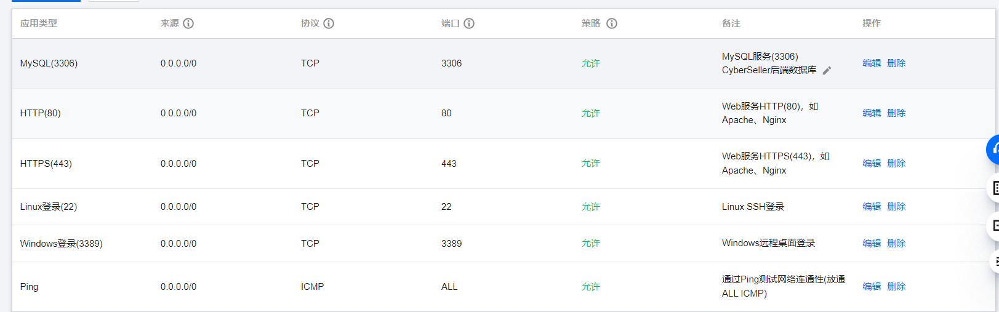

# backend

后端由[YJK](@saltyfishyjk)负责开发和维护，本文档是对其他开发者提供的说明文档。

## Part 0 后端项目速览

对于非后端开发人员，这里的多数内容并不需要掌握甚至了解，因此，在本Part中着重介绍后端项目概览，以及如何快速高效地找到你需要的信息。

### 谁是本文的读者

你可能是前端开发者或其他技术人员或旁观者。因此，后文中的”你“指代这三类人员。

### 关于本文档

**Part 1**中主要介绍了环境配置的具体信息以及搭建他们的过程和途中踩过的坑。在仅需要使用后端提供的服务的时候，你不需要阅览这部分；在环境配置时，你可以参考其中的版本等信息；在深入了解为何我们选择这样的环境以及其相互之间的协作的时候，你需要仔细阅览这部分。

**Part 2**中主要介绍了如何快速使用后端服务器并上手。多数时候，你并不需要关心后端和服务器是如何工作的，查阅后端提供的API文档足矣；但是如果你需要进入后端服务器并进行一些改动乃至特权操作的时候，你需要仔细阅览本部分；当你的操作有一定危险的时候，应当辅以**Part 1**仔细阅览。

## Part 1 环境与配置

基于稳定性等多方考虑，最终选择的配置如下：

| 环境   | 版本  | 备注                                         |
| ------ | ----- | -------------------------------------------- |
| Ubuntu | 20.04 | 选购了腾讯云2核2G5M50GB服务器                |
| Python | 3.9.7 | 使用`activate SyberSeller`进入本项目虚拟环境 |
| Django | 3.2   | 目前（2022.10）最新的LTS                     |
| MySQL  | 8.0   | 老师不推荐用SQLite，因此选用MySQL:cry:       |
|        |       |                                              |

### 进入服务器与开发环境

使用xshell连接，配置如下：

| 属性   | 值               |
| ------ | ---------------- |
| 名称   | CyberSeller      |
| 主机   | 43.143.179.158   |
| 端口   | 22               |
| 用户名 | ubuntu           |
| 密码   | CyberSeller2022! |

> 上述用户名和密码是root权限，请谨慎操作！

### 使用DataGrip等工具远程连接数据库

| 属性     | 值               |
| -------- | ---------------- |
| Host     | 43.143.179.158   |
| Port     | 3306             |
| 数据库名 | CyberSeller_db1  |
| User     | root             |
| password | CyberSeller2022! |

> 上述用户名和密码是root权限，请谨慎操作！
>
> 如果忘记退出mysql就关闭服务器，会出现下一次无法登录mysql的错误，可以参考[这篇文章](https://blog.csdn.net/weixin_41004763/article/details/100139802)中的指令修复。

***

以下介绍从零（刚购置的腾讯云服务器）开始进行的各项环境配置，以备查看。如果仅使用本服务器，则无需阅读。

### 安装conda

完全按照[这篇博客](https://zhuanlan.zhihu.com/p/459607806)操作。

### 创建本项目虚拟环境

```bash
conda create --name CyberSeller python=3.9
```

### 安装Django 3.2

```bash
pip install Django==3.2
```

### 安装MySQL

参考[这篇文章](https://cloud.tencent.com/developer/article/1622599)安装MySQL

### MySQL的启动/停止

- 启动：`service mysql start `
- 关闭：`service mysql stop`

### 配置MySQL root

参考[这篇文章](https://blog.csdn.net/weixin_44509186/article/details/119765206)及其评论，进行如下操作：

- cat默认用户名和密码：`sudo cat /etc/mysql/debian.cnf `，得到默认用户和密码：

  ```
  [client]
  host     = localhost
  user     = debian-sys-maint
  password = LjrLhREPwJmRO0qa
  socket   = /var/run/mysqld/mysqld.sock
  ```

- 使用默认user和password登录：`mysql -udebian-sys-maint -p`，然后输入密码`LjrLhREPwJmRO0qa`进入默认账户

- 由于我们的MySQL版本是8.0，因此使用`update mysql.user set authentication_string='', plugin='mysql_native_password' where user='root';`置空字段，然后使用`flush privileges;`刷新（注意这里原博客没有写明要刷新，但是评论有人指出需要刷新，不刷新会有问题）

- 然后修改密码`ALTER user 'root'@'localhost' IDENTIFIED BY 'root';`其中`root`是新密码，接着使用`flush privileges;`刷新

- 最后，`exit`退出当前MySQL账户并使用`root`和新密码登录。

### 创建项目用数据库

```bash
create database CyberSeller_db1 default charset=utf8;
```

### 设置允许远程连接数据库

- 参考[这篇文章](https://blog.csdn.net/ndjdi/article/details/113184194)进行操作，注意完成其中步骤后需要重启MySQL服务。
- 由于腾讯云的安全组限制，还需要在腾讯云服务器后台开放3306端口（数据库端口）



### 安装pymysql

```bash
pip install pymysql
```

### 安装git

没什么坑，参考[这篇文章](https://blog.csdn.net/beishanyingluo/article/details/107451921)

## Part 2 使用服务器

在**Part 1**中，主要介绍了目前已经安装和运行的环境以及如何从零部署他们的办法，以下介绍对于其他开发人员，如何在CyberSeller服务器上快速进入开发环境

### 连接服务器

根据**Part 1**中提供的服务器参数，使用Xshell等终端工具远程连接服务器。

### 激活环境

一般状况下，连接已经开机并正常运行的服务器时如果看到类似`(base) ubuntu@VM-8-14-ubuntu:`的字样，只需要`conda activate CyberSeller`进入已经配置好的环境；如果你对服务器进行重启，那么需要参考[这篇文章](https://blog.csdn.net/wa2661391317/article/details/89203999)，使用`source ~/.bashrc`命令进行激活，然后再`conda activate CyberSeller`进入已经配置好的环境。

当你进入`CyberSeller`的虚拟环境后，你已经处于开发环境中的Python和Django当中。对于只进行应用操作而言，你不需要了解更多信息，但如果你要对环境进行某些操作，那么应当仔细阅览**Part 1**。

### 连接数据库

多数时候，你可以通过自己本地的DataGrip等数据通过**Part 1**提供的数据库参数连接服务器，并不需要在服务器上查看数据库（这通常不很直观）。但如果你希望在服务器上查看或进行某些操作，请仔细阅览**Part 1**。

### git pull与后端开发和部署的工作逻辑

后端是这样开发的：

- 本地Windows+PyCharm进行代码编写和开发
- 本地`git commit & push`到GitHub
- 服务器`git pull`到服务器上（由于Django可以自动检测项目变化并自动重新部署，因此不需要额外操作）
- 本地Postman等工具进行测试

注意，在上面的流程中，我们严格限制了在且仅在本地Windows+PyCharm换几个进行代码的编写，在服务器上我们不编写甚至不打开查看代码，这是为了保证本地和服务器上的代码始终保持一致，这也是git提供的优秀的版本管理功能。

因此，当你需要修改后端代码的时候，应当严格按照上述流程，避免产生不确定的风险。

### 运行Django服务

多数时候，得益于Django的自动部署性质，你不需要查看或修改Django服务的运行。

如果遇到这样的情况，首先应当按照本**Part**第二条所述进入虚拟环境`CyberSeller`，然后使用命令`screen -r 4493`进入Django部署所在的`screen`（如果你还不清楚`screen`系列指令，请查阅[这篇文章](https://saltyfishyjk.github.io/2022/03/27/Linux%E7%BB%88%E7%AB%AF%E7%AC%94%E8%AE%B0/#screen%E7%B3%BB%E5%88%97%E6%8C%87%E4%BB%A4)；使用`ctrl + C`可以停止Django服务；在`manage.py`所在的目录下使用`python manage.py runserver 0:8080`启动Django服务，这一操作使用了8080端口并支持外网访问，我们已经配置完善了环境以确保你只需要执行此指令即可正常启动。

如果你想要切换端口或者进行其他什么操作，可以查阅**Part 1**。

### 测试后端API

我们推荐你使用Postman这一免费工具进行测试。对于具体API的测试方法，你可以仔细查阅《API README》文档。

## Part [FINAL] 踩坑记录

> 由于可能在中间增补一些**Part**，因此本**Part**的编号待定

### Server Error 500

该错误发生时没有任何其他报错信息，后经仔细排查是视图函数内部在向数据库插入新值时少写一个域，导致报错。具体的排查方法是在视图函数内的不同地方打印字符串，查看是否可以正常输出，如果输出，说明错误在其之后，反之说明错误在其之前（这也是利用了python作为解释型语言的特点，即很多错误是运行到时才会报出）
