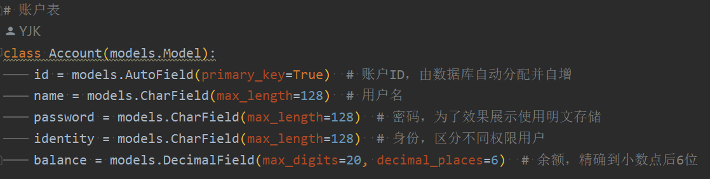
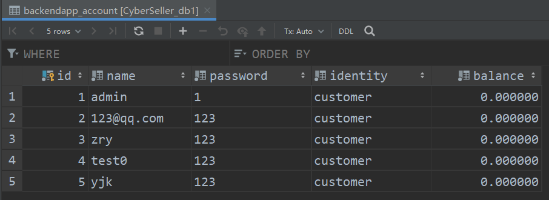
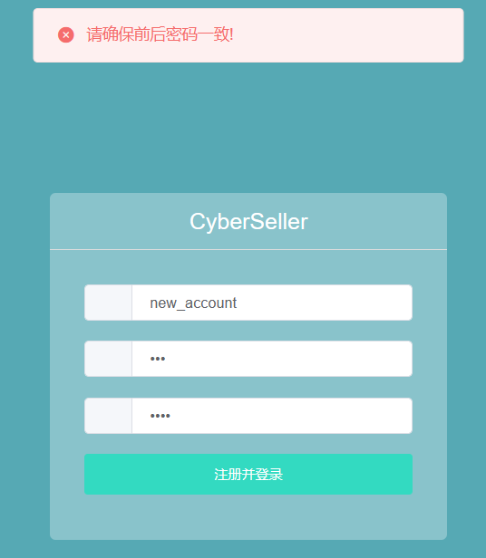
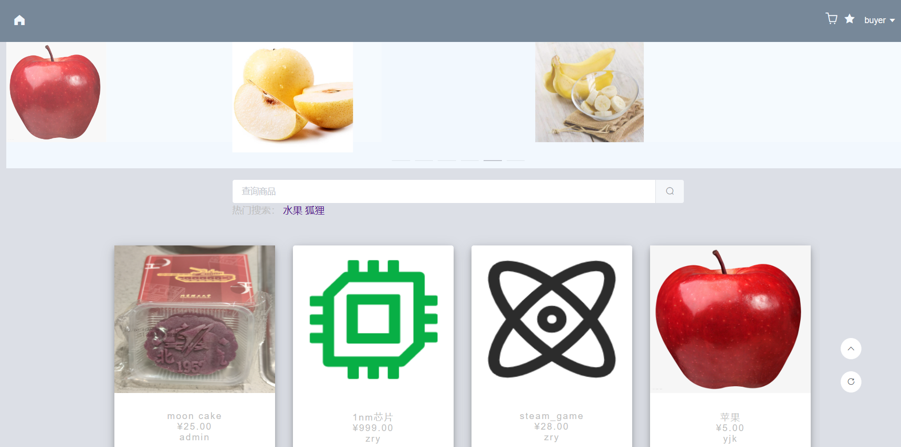
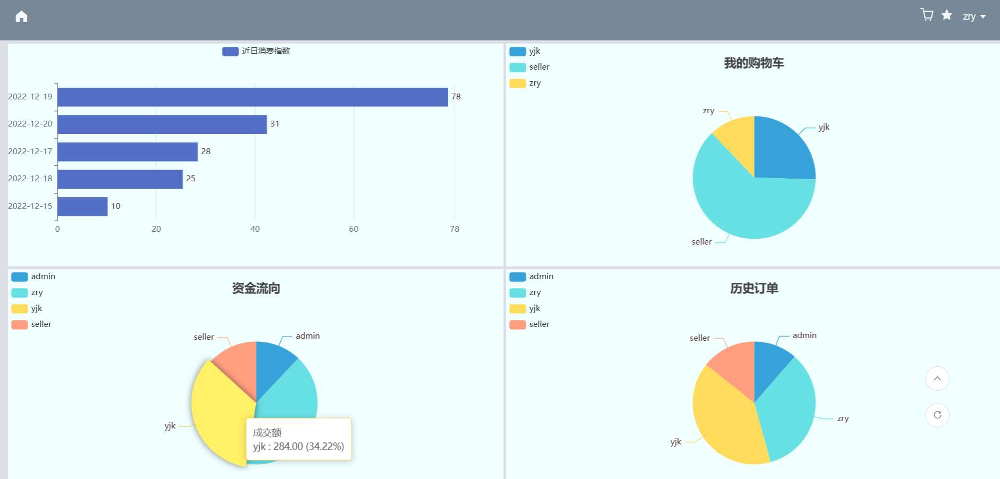
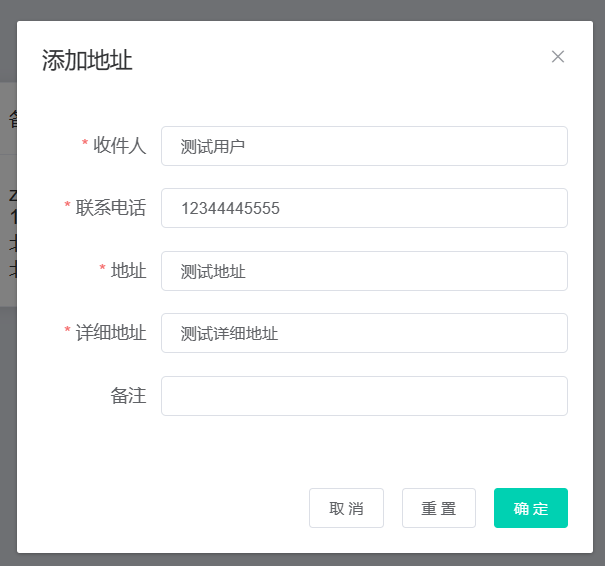

<h1>
    <div align = "center">《数据库系统原理》课程设计</div>
</h1>
<h1>
    <div align = "center">系统实现报告</div>
</h1>


<h2>
    <div align = "center">CyberSeller——全自主线上交易平台</div>
</h2>


<h4>
    <div align = "center">小组成员</div>
</h4>

<h5>
    <div align = "center">于敬凯 20373673</div>
</h5>

<h5>
    <div align = "center">占瑞乙 20373738</div>
</h5>

<h5>
    <div align = "center">金圣浩 20373795</div>
</h5>


<h6>
    <div align = "center">2022年12月</div>
</h6>
<div STYLE="page-break-after: always;"></div>

[TOC]


### 一、实现环境

| 环境   | 版本  |
| ------ | ----- |
| Ubuntu | 20.04 |
| Python | 3.9.7 |
| Django | 3.2   |
| MySQL  | 8.0   |
| VUE    | 2.5.2 |


### 二、 系统功能结构图


### 三、 基本表的定义，主外码等完整性约束定义，索引的定义

#### 1. Account用户表

| 属性名   | 中文名 | 数据类型 | 备注 |
| -------- | ------ | -------- | ---- |
| id       | 编号   | INT      | 主码 |
| name     | 用户名 | VARCHAR  |      |
| password | 密码   | VARCHAR  |      |
| identity | 身份   | VARCHAR  |      |
| balance  | 余额   | DECIMAL  |      |

#### 2. Good商品表

| 属性名      | 中文名   | 数据类型 | 备注        |
| ----------- | -------- | -------- | ----------- |
| id          | 编号     | INT      | 主码        |
| name        | 商品名   | VARCHAR  |             |
| price       | 价格     | DECIMAL  |             |
| seller_id   | 卖家编号 | INT      | 外键        |
| maker       | 制造商   | VARCHAR  |             |
| picture     | 图片地址 | VARCHAR  | 存储图片URL |
| description | 详细描述 | VARCHAR  |             |
| date        | 生产日期 | VARCHAR  |             |
| shelf_life  | 保质期   | VARCHAR  |             |

#### 3. ShopCart购物车表

| 属性名  | 中文名           | 数据类型 | 备注 |
| ------- | ---------------- | -------- | ---- |
| id      | 编号             | INT      | 主码 |
| user_id | 用户编号         | INT      | 外键 |
| good_id | 商品编号         | INT      | 外键 |
| num     | 购物车内商品数量 | INT      |      |

#### 4. Star收藏表

| 属性名  | 中文名   | 数据类型 | 备注 |
| ------- | -------- | -------- | ---- |
| id      | 编号     | INT      | 主码 |
| user_id | 用户编号 | INT      | 外键 |
| good_id | 商品编号 | INT      | 外键 |
| like    | 是否收藏 | INT      |      |

#### 5. Repo库存表

| 属性名  | 中文名   | 数据类型 | 备注 |
| ------- | -------- | -------- | ---- |
| id      | 编号     | INT      | 主码 |
| user_id | 用户编号 | INT      | 外键 |
| good_id | 商品编号 | INT      | 外键 |
| like    | 是否收藏 | INT      |      |

#### 6. Address地址表

| 属性名        | 中文名         | 数据类型 | 备注 |
| ------------- | -------------- | -------- | ---- |
| id            | 编号           | INT      | 主码 |
| user_id       | 用户编号       | INT      | 外键 |
| receiver_name | 收件人姓名     | VARCHAR  |      |
| phone         | 收件人电话     | VARCHAR  |      |
| addr          | 地址           | VARCHAR  |      |
| detailed_addr | 详细地址       | VARCHAR  |      |
| comment       | 备注           | VARCHAR  |      |
| default       | 是否为默认地址 | VARCHAR  |      |

#### 7. Sale订单表

| 属性名     | 中文名   | 数据类型 | 备注 |
| ---------- | -------- | -------- | ---- |
| id         | 编号     | INT      | 主码 |
| user_id    | 用户编号 | INT      | 外键 |
| address_id | 地址编号 | INT      | 外键 |
| price      | 价格     | INT      |      |
| date       | 日期     | DATETIME |      |

#### 8. SaleGood订单商品表

| 属性名  | 中文名   | 数据类型 | 备注 |
| ------- | -------- | -------- | ---- |
| id      | 编号     | INT      | 主码 |
| sale_id | 订单编号 | INT      | 外键 |
| good_id | 商品ID   | INT      | 外键 |
| num     | 商品数量 | INT      |      |

#### 9. GoodDetail商品详情表

| 属性名     | 中文名   | 数据类型 | 备注 |
| ---------- | -------- | -------- | ---- |
| id         | 编号     | INT      | 主码 |
| user_id    | 用户编号 | INT      | 外键 |
| address_id | 地址编号 | INT      | 外键 |
| price      | 价格     | INT      |      |
| date       | 日期     | DATETIME |      |

#### 10. 索引

对查询常用的属性添加索引可以大大提高查询效率，码的查询频次高，外键多用于关系的连接操作，所以关系的索引设置在主码和外键上，以下加粗部分表示索引：

- 账户表（**编号**，**用户名**，**密码**，身份，余额）

- 商品表（**编号**，商品名，价格，**卖家编号**，制造商，图片地址，描述，生产日期，保质期）
- 购物车表（**编号**，**用户编号**，**商品编号**，数量）
- 收藏表（**编号**，**用户编号**，**商品编号**，收藏）
- 库存表（**编号**，**商品编号**，库存）
- 地址表（**编号**，**用户编号**，收件人姓名，收件人电话，地址，详细地址，备注，默认地址）
- 订单表（**编号**，**用户编号**，**地址编号**，价格，日期）
- 订单商品表（**编号**，**订单编号**，**商品编号**，数量）
- 商品详情表（**编号**，**商品编号**，键值，值）

### 四、 系统的安全性设计，不同人员的外模式及相关权限

本系统后端采用Django+MySQL的方式来搭建，具有一定的安全性。

<table>
<tr>
	<td></td>
    <td></td>
<tr>
</table>

#### 1. 数据库与控制程序隔离

Django框架将控制程序与数据库解耦，因此控制程序并不会直接产生并调用 SQL 语句来操作数据库，而是通过 OR Mapping 来间接操作数据库。因此安全性有一定的保障——可以防御诸如 SQL 注入的攻击

#### 2. 防御 SQL 注入

SQL 注入能让恶意用户能在数据库中执行任意 SQL 代码。这将导致记录被删除或泄露。

Django 的 querysets 在被参数化查询构建出来时就被保护而免于 SQL 注入。查询的 SQL 代码与查询的参数是分开定义的。参数可能来自用户从而不安全，因此它们由底层数据库引擎进行转义。

#### 3. 防御跨站脚本攻击（XSS）

XSS 攻击允许用户将客户端脚本注入到其他用户的浏览器中。这通常是通过将恶意脚本存储在数据库中，在那里它将被检索并显示给其他用户，或者通过让用户点击一个链接，使攻击者的 JavaScript 被用户的浏览器执行来实现。然而，XSS 攻击可以来自任何不受信任的数据源，如 cookie 或网络服务，只要数据在被纳入页面之前没有被充分净化。Django可以保护免受大多数XSS攻击。

#### 4. 防御跨站点请求伪造（CSRF）

发起 CSRF 攻击的人可以使用其他用户的证书执行操作，且是在其不知情或不同意的情况下。Django 内置了保护措施来防御大多数 CSRF 攻击。

#### 5. Host 头部验证

在某些情况下，Django 使用客户端提供的 `Host` 头部来构造 URLs。这些值虽被清理以阻止跨站脚本攻击，但伪造 `Host` 值还是可以用于跨站请求伪造，缓存毒化攻击，以及电子邮件中的有毒链接。

#### 6. 按用户类别设置外模式与权限

本系统中有两种用户，`admin`和`customer`，其中`admin`作为超级账号对数据库有完全权限，并可以增删改查所有数据，对所有数据进行综合分析等；`customer`作为普通用户账号可以增删改查自己账户内数据，对自己数据进行统计分析等。

#### 7. 数据加密
为了保证数据的安全性，我们对密码，密保问题答案等隐私数据进行加密。项目使用了对称加密方法 AES 进行数据加密。 AES Advanced Encryption Standart ，高级加密标准）是最为常见的对称加密算法。本项目中加密与解密均由服务端完成，所以采用对称的加密算法是既简单又高效的。 AES 是分组加密技术，具体的流程如下图所示：


### 五、 存储过程、触发器和函数的代码说明

#### 1. 存储过程

我们的项目中对较为复杂的操作在 SQL 层面封装成过程，由于 SQL 中的函数与过程是预先编译并存入 DBMS 中的，调用的时候过程内部不需要解释执行，提高了 SQL 的执行效率，也简化了高级语言的处理逻辑。

根据实际需求，我们使用了如下存储过程：
##### 2. 搜索相似后缀名商品

```sql
# 存储过程
use CyberSeller_db1;
drop procedure if exists searchGood;
delimiter $$
create procedure searchGood(in input varchar(255))
begin
    select *
        from backendapp_good
            where name like concat('%', input);
end $$
delimiter ;
```

根据用户输入的关键词可以检索和关键词相似的商品，根据数据统计和分析，相似商品往往可能拥有相似后缀，如“星巴克咖啡”和“瑞星咖啡”，用户检索“咖啡”时就会显示这两个商品。

#### 3. 触发器

触发器对于保证数据一致性有很大帮助，而且有时候将数据更新在数据库层面完成，可以简化高级语言的处理逻辑。但是触发器的性能并不好，而且容易出现循环触发等问题，所以我们对于更新数据量为一条数据，与其他数据耦合度小，功能比较独立的操作才使用触发器。

##### 3.1 库存数管理

库存数的更新是一个局部细节问题，与其余问题耦合度小，涉及数据仅为一样商品库存信息，所以我们使用了触发器。

```sql
DELIMITER $$
CREATE TRIGGER 库存大于等于零 after update on backendapp_repo
    for each row
    begin
        if (new.repo < 0) then
            signal sqlstate '65666' set message_text = '库存不能小于0';
        end if;
    end $$
DELIMITER ;
```

#### 4. 函数

用户时常关心商品的价格区间胜过具体价格，对于一般用户而言，其对商品价格的敏感度可以为大于`5000`元时认为昂贵，`2000-5000`元时认为一般，小于`2000`元时认为廉价，因此我们设计了查询函数来快速判断商品价格。

```sql
use CyberSeller_db1;
DELIMITER $$
CREATE FUNCTION getPrice(price integer) RETURNS varchar(3)
DETERMINISTIC
BEGIN
    case
        when (price >= 5000) then return '昂贵';
        when (price >= 2000) then return '一般';
        else return '廉价';
    end case;
END $$
DELIMITER ;
```

### 六、实现过程中主要技术和主要模块的论述

#### 1. Django 框架

Django是由Python编写的开源Web应用框架，Python+Django+Vue是网站开发与部署的常见组合。

- 齐全的功能。自带大量常用工具和框架，可轻松、迅速开发出一一个功能齐全的Web应用。

- 完善的文档。Django已发展十余年，具有广泛的实践案例，同时Django提 供完善的在线文档，Django用户能够更容易地找到问题的解决方案。

- 强大的数据库访问组件。Django自带一个面向对象的、反映数据模型(以Python类的形式定义)与关系型数据库间的映射关系的映射器(ORM)，开发者无须学习SQL语言即可操作数据库。

- 灵活的URL映射。Django提供一个基于正则表达式的URL分发器，开发者可灵活地编写URL。

- 丰富的模板语言。Django模板语言功能丰富，支持自定义模板标签。Django也支持使用第三方模板系统，如jinja2等 。

- 健全的后台管理系统。Django内置了-一个后台数据管理系统，经简单配置后，再编写少量代码即可使用完整的后台管理功能。

- 完整的错误信息提示。Django提供 了非常完整的错误信息提示和定位功能，可在开发调试过程中快速定位错误或异常。

- 强大的缓存支持。Django内置了一个缓存框架，并提供了多种可选的缓存方式。

- 国际化。Django包含一个国际化系统，Django组件支持多种语言。

##### 1.1 Django 模型映射数据库实体（OR Mapping）

Django 提供了 Model 映射数据库实体，在本项目中，`CyberSllerDjangoBackEnd/backendapp/models.py`中以Python类的形式记录了表单的结构，方便使用Django提供的OR Mapping API直接操作数据库。如下图中，左侧为`models.py`中的类结构，右侧为数据库中的对应表单。

<table>
<tr>
	<td></td>
    <td></td>
<tr>
</table>

##### 1.2 增删改查

在Django框架中，对数据库操作提供了良好的封装（相较于pymysql而言），增删改查变得更加面向对象。

###### 1.2.1 增

```python
good = Good(name=name, price=price, seller_id=seller_id,
					maker=maker, picture=pic_url, description=description,
					date=date, shelf_life=shelf_life)
good.save()
```

###### 1.2.2 删

```python
good_obj = Good.objects.get(id = 1)
good_obj.delete()
```

###### 1.2.3 改

```python
# 方法一
good = Good.get(did = 1) # 相当于SQL查询，good为Good对象
good.name = "new_name" # 修改内容
good.save() # 保存上传
```

###### 1.2.4 查

**获取全部数据**

```python
# objects是模型管理器，all()返回了所有数据行，某种程度上相当于SQL中的SELECT * FROM
# 其中，ls是一个列表，其中每一个元素是Good对象，这是比pymysql更优雅的地方
good = Goods.objects.all()
```

**按条件获取数据**

```python
goods = Good.objects.filter(seller_id=user_id)
```

#### 2. MySQL 数据库

尽管Django自带了Sqlite3数据库，但这一数据库过于轻量级，不很符合本课程设计的要求。

相较而言，MySQL作为最流行的数据库之一，其功能完整，性能优良，表现稳定，适合本项目使用。

#### 3. 路由 - 控制器 - 渲染

前端发送请求后，路由接收到前端的请求，随后根据`CyberSellerDjangoBackEnd/backendapp/urls.py`中定义的路由信息，找到`CyberSellerDjangoBackEnd/backendapp/views.py`对应的控制器（Controller）与动作（Action）。本项目的路由信息可由如下命令给出：

| 名称                   | URL                                               | 行为                           | 方式           |
| ---------------------- | ------------------------------------------------- | ------------------------------ | -------------- |
| `signup`               | `http://43.143.179.158:8080/signup`               | 注册                           | POST/JSON      |
| `login`                | `http://43.143.179.158:8080/login`                | 登录                           | POST/JSON      |
| `addGoods`             | `http://43.143.179.158:8080/addGoods`             | 添加售卖商品                   | POST/FORM-DATA |
| `updateShopCart`       | `http://43.143.179.158:8080/updateShopCart`       | 添加商品到购物车               | POST/FORM-DATA |
| `mainRecommendGoods`   | `http://43.143.179.158:8080/mainRecommendGoods`   | 为用户推荐商品                 | POST/FORM-DATA |
| `getGood`              | `http://43.143.179.158:8080/getGood`              | 获取指定商品所有信息           | POST/FORM-DATA |
| `searchShopCart`       | `http://43.143.179.158:8080/searchShopCart`       | 获取用户购物车内所有商品和数量 | POST/FORM-DATA |
| `updateStar`           | `http://43.143.179.158:8080/updateStar`           | 更新收藏关系                   | POST/FORM-DATA |
| `getSixPictures`       | `http://43.143.179.158:8080/getSixPictures`       | 获取首页六张滚播图             | POST/FORM-DATA |
| `updateRepo `          | `http://43.143.179.158:8080/updateRepo`           | 更新库存容量                   | POST/FORM-DATA |
| `getSellGoods `        | `http://43.143.179.158:8080/getSellGoods`         | 获取正在售卖的商品             | POST/FORM-DATA |
| `goodsRecommendGoods`  | `http://43.143.179.158:8080/goodsRecommendGoods ` | 为商品推荐商品                 | POST/FORM-DATA |
| `getStarGoods`         | `http://43.143.179.158:8080/getStarGoods `        | 获取收藏商品                   | POST/FORM-DATA |
| `deleteGood`           | `http://43.143.179.158:8080/deleteGood`           | 删除指定商品                   | POST/FORM-DATA |
| `analyseExcel`         | `http://43.143.179.158:8080/analyseExcel`         | 解析Excel文件                  | POST/FORM-DATA |
| `analyseShopCart`      | `http://43.143.179.158:8080/analyseShopCart`      | 分析用户购物车内商品信息       | POST/FORM-DATA |
| `addAddress`           | `http://43.143.179.158:8080/addAddress`           | 添加地址                       | POST/FORM-DATA |
| `addSale`              | `http://43.143.179.158:8080/addSale`              | 添加订单                       | POST/FORM-DATA |
| `addSaleGood`          | `http://43.143.179.158:8080/addSaleGood`          | 添加订单商品关系               | POST/FORM-DATA |
| `analyseSale`          | `http://43.143.179.158:8080/analyseSale`          | 分析订单商品信息               | POST/FORM-DATA |
| `getGoodDetail`        | `http://43.143.179.158:8080/getGoodDetail`        | 获取商品详情                   | POST/FORM-DATA |
| `getAddress`           | `http://43.143.179.158:8080/getAddress`           | 获取地址                       | POST/FORM-DATA |
| `deleteAddress`        | `http://43.143.179.158:8080/deleteAddress`        | 删除地址                       | POST/FORM-DATA |
| `updateDefaultAddress` | `http://43.143.179.158:8080/updateDefaultAddress` | 设置默认地址                   | POST/FORM-DATA |
| `analyseLike`          | `http://43.143.179.158:8080/analyseLike`          | 分析用户收藏商品信息           | POST/FORM-DATA |
| `updateShopCartNum`    | `http://43.143.179.158:8080/updateShopCartNum`    | 更新购物车商品数量             | POST/FORM-DATA |

随后落入当前请求对应的控制器动作中，由控制器来进行 ORM 操作，并发回前端。

#### 4. 服务器

服务器端选择租赁腾讯云轻量级服务器，操作系统为Ubuntu20.04，使用`conda`进行虚拟环境管理，使用`Django=3.2`这一目前最新的LTS开发；为数据库开放了3306端口，为后端API开放80端口，为SSH开放22端口。

通过将后端Django项目和数据库部署在服务器上，实现了前后端分离，便于前端开发时不需要配置和部署后端环境，只需要使用后端提供的URL和API即可，同时在开发过程中解决了跨域等问题，实现了生产环境级别的部署。

同时，本项目支持用户上传商品图片，通过在服务器储存图片并提供GET方法访问图片来实现这一功能。

#### 5. 主要模块——MVC模块




### 七、 若干展示系统功能的运行实例

#### 1. 系统功能介绍

我们的商城系统功能介绍如下：

- 首先，进入商城主界面，默认为 `admin` 的游客模式，在主页中，可以浏览所有商品，也可以通过搜索框对商品进行模糊搜索以便筛选，最上方的滚屏将显示目前商城为用户推送的最热门的六种商品。用户可以随时从左上角的主界面按钮返回主界面。
- 随后，用户可以选择`查看详情`查看跳转至商品详情页查看商品的具体信息，也可以选择将商品加入购物车或加入收藏列表。
- 接下来，用户需要登录账号以解锁更多功能。当用户从右上角的登录处注册账号并登录或直接登录已有账号后，右上角将依次显示`我的购物车`、`我的收藏`、`菜单栏`，其中菜单栏中又有`我的订单`、`我的信息`、`地址管理` 及 `发布商品` 这四个子项目。
- 点击`地址管理`按钮，进入到地址管理页面，用户可以在该页面设置默认的收货地址、添加新的收货地址、删除已有的收货地址。
- 点击`我的购物车`按钮，进入到购物车页面，用户可以在该页面查看并编辑自己已加入购物车的所有商品、价格与数量，也可以选择其中的部分或全部商品生成订单并跳转到订单提交页面进行结算。
- 在结算订单时，用户将看到该笔订单的详细信息并可以选择收货地址，在确认无误后即可进行最终结算。
- 点击`我的收藏`按钮，进入到收藏列表页面，用户可以在该页面查看自己已添加收藏的所有商品及相关信息。
- 点击`我的订单`按钮，进入到历史订单页面，用户可以在该页面查看该账号的所有成交过的历史订单信息。
- 点击`我的信息`按钮，进入到用户个人信息分析页面，用户可以在该页面查看该账号的历史数据分析图，了解相关消费趋势。
- 点击`发布商品`按钮，进入到商品发布页面，用户可以在该页面查看并编辑自己已经发布在售的所有商品，也可以选择添加新的商品进行售卖。

#### 2. 用户注册与登录

进入`CyberSeller`在线交易平台后，系统默认以`admin`作为游客模式账号进行登录，页面右上角的菜单栏将被隐藏，仅将登录接口暴露给游客：


用户在游客模式下仅能浏览商品列表及商品详情页，并无用于存储个人数据的专属的个人账号。

在选择`登录`后用户将跳转至注册登录页面，用户可以在此处选择注册或登录自己的账号：


在注册账号时，用户需要确保其输入的用户名合法，以及前后两次输入的密码保持一致，否则，系统将告知`请确保前后密码一致`的错误信息，要求用户进一步检查自己两次输入的密码是否一致。



当然，如果之前已经注册过账号，那么用户可以选择使用已有的账号密码进行登录：

> 这里使用测试账户登录并进行实验和进一步展示
>
> username: zry
>
> password: 123


如果输入密码错误或用户名不存在，那么系统会告知`用户名或密码错误`，要求用户进一步检查自己的个人信息后重新提交。


用户在确认密码无误并成功登录后，页面上方将显示`登录成功`的提示窗：


此时页面将自动跳转回主界面进行商品陈列，同时，页面右上角的菜单栏中将为已登录用户解锁更多的功能，即获取了比游客模式更高的访问权限：


此后，如果用户想要切换账号，或者重新注册账号，可以选择从菜单栏中的`退出登录`按钮，随后将再次跳转至用户的注册与登录界面（退出登录后用户将再次回到游客模式，默认游客名为`admin`）。

#### 3. 商品展示及相关操作

在主界面——商品陈列页面中，用户可以在顶部的图片滚播窗口中看到共六项系统基于所有用户数据进行的全平台商品推送，窗口间距为三张图片，滚播窗口共有六张图片：


随后，在搜索框中，用户可以通过多种关键词进行商品检索（搜索模式采用完全匹配以及模糊匹配），筛选其所需要的商品，用户可以通过商品名检索相应商品：


用户可以通过价格检索相应商品：


用户可以通过卖家名称检索相应商品：


在浏览至商品陈列页面底部后，用户可以选择进行页面跳转，获取其他页面的商品内容：


在浏览过程中，用户可以将指针悬浮在任一商品上，商品卡片栏将会将`查看详情`与`加入收藏夹`按钮暴露给用户，用户可以点击`查看详情`跳转进入商品详情页查看商品的更多相关信息或点击五角星图标将商品加入收藏夹留待以后查看：


在点击`查看详情`后，用户将进入商品详情页，可以查看更多商品相关信息：


用户可以通过点击`加入购物车`或`收藏`按钮将相应数量的该商品加入购物车或加入收藏夹，在成功加入后页面将会返回成功加入购物车/收藏夹的系统提示:


当然，在商品详情页中还会展示当前商品的剩余库存，用户选择加入购物车的商品数量不得超过当前库存总数：


可以看见，当选中的商品数量等于库存数量后，继续添加商品的`+`按钮变灰，成为不可点选状态。

此外，用户可以基于卖家展示的商品图片进行`视觉搜索`，在全网进行商品比对、同类商品信息查询等：


继续下拉页面，用户将看到基于该商品的商品推荐（猜你喜欢）以及卖家展示的商品详细信息：


与商品陈列页面类似，用户可以直接点击`猜你喜欢`一栏中的商品进行跳转，查看感兴趣的其他商品的详细信息：


在浏览完商品信息后，如果用户想要回到主界面继续查询或浏览其他商品，可以通过点击页面左上角的`Home`图标返回主界面。

这里使用一个新注册的账号简单演示本系统的推荐功能。注册并登录后，为新用户`buyer`提供的主界面如下：



在新用户`buyer`购买过一次香蕉之后，系统为用户`buyer`提供的主界面如下：


可以看到系统基于用户的历史数据进行了一定程度的相似推荐。

#### 4. 买家实例演示

买家可通过选择页面右上角购物车标识图标进入`我的购物车`页面：


在`我的购物车`页面中，买家可以查看所有已加入购物车的商品信息——包含商品图片、商品名、商品状态（售罄或在售）、商品单价、商品数量及总价格。

买家可通过在右上侧的搜索框进行关键词检索，筛选购物车内的特定商品：


选好准备结算的商品后，买家可通过在左侧勾选需要购买的商品，并调整对应商品的数量来进行结算操作：


系统将自动为买家计算所选商品的总件数与总价格，并将其显示在页面右下角。当然，如果商品正处于售罄状态，用户将无法选中该商品进行结算。

点击`结算选中商品`按钮即进入结算界面，买家将可以选择收货地址（默认为默认地址）进行支付结算，在支付前用户可以最后一次确认该笔订单的详细信息（含商品数量及对应价格）：


在买家确认订单信息无误后，可点击`确认支付`按钮进行最终支付，支付成功将获得系统的如下反馈：


此外，买家可通过选择页面右上角五角星标识的图标进入`收藏夹`页面：


在该页面买家可以进一步查看自己已加入收藏夹的所有商品的商品图片、商品名、价格及商品当前售卖状态等相关信息。

买家可通过选择页面右上角菜单栏中`我的订单`选项卡以进入`我的订单`页面：


在该页面买家可以查询自己每一条已成交历史订单的商品图片、商品名、卖家、价格等相关信息。

买家可通过选择页面右上角菜单栏中`我的信息`选项卡以进入用户的历史数据回顾页面：


在该页面中共有四个图表，左上角的柱状图会动态对用户的历史消费记录进行动态排序，以日为单位对历史总消费额进行统计；右上角的饼状图会对用户购物车中的商品来源进行统计；左下角的饼状图会对用户的历史支付中的资金流向进行统计；右下角的饼状图会对用户的历史订单按成交次数分布进行统计。由于以上图表均为动态显示模式，所以用户可以根据需求对图表显示数据进行进一步筛选查看或对统计数据及图表进行下载并导出为`.pdf`：



买家可通过选择页面右上角菜单栏中`地址管理`选项卡以进入`地址管理`页面：


买家可以在地址卡片栏顶部选择一个地址将其`设置为默认`、选择`删除地址`删除一个非默认地址、选择`添加`新建一个新的收货地址。

买家可以通过点击`添加`按钮在新建地址界面输入新地址所必需的信息——收件人、联系电话、地址、详细地址，以及可选项——备注。


同样，买家可以通过重置按钮一件清空已填写的地址信息，进行重新填写。当买家填写完并确认个人地址信息无误后，可以点击确定按钮确认新建地址：



点击`确定`后新建地址成功，但新建的地址不为默认地址：


再次点击`设置为默认`可以将新建立的备用地址设置为默认地址：


设置默认地址成功，再点击`删除地址`删除第二个备用地址：


第二个地址被成功删除。

#### 5. 卖家实例演示

卖家可通过选择页面右上角菜单栏中`发布商品`选项卡以进入`发布商品`页面：


在左侧，卖家可以发布新的商品，其必须给出的参数为商品名、商品价格和商品图片，而制造商、生产日期、保质期、商品描述等为可选参数，卖家可根据自己的需求进行选择是否添加。最后，卖家也可以通过`其他`选项卡上传后缀为`.xlsx`、`.xls`的指定格式的Excel文件，后端可以对其进行解析并展示：


卖家在上图中填入商品详细信息后，如果发现填入信息有误，可以选择逐项修改，或者选择`重置`按钮进行一键重置，将所有已填入信息进行清空。卖家在确认需要发布的商品信息无误后选择`发布商品`即可立即添加该商品到待售列表：


卖家在右侧已发布商品列表中可以立刻看到自己新添加的商品信息。

在右侧的待售列表中，卖家可以查看自己已经发布过的所有商品，所有商品信息都将以图片、商品名、售卖状态、单价、库存的形式向卖家进行展示，卖家可以根据自己的需要实时修改所有商品的库存数量或直接下架商品，而平台上的其他用户也将在买家界面同时看到卖家对商品信息的相应修改：


卖家可以通过库存数量左右两侧的`-`和`+`按钮对商品库存数量进行逐项修改，特别的，当商品数量为0时，商品的状态将切换为`售罄`状态，而当商品数量大于0时，商品的状态为`在售`状态。

最后，如果卖家决定不再出售某项商品后，可以选择对应商品右侧的`下架商品`按钮：


例如，此处将刚刚发布的商品进行下架后，该商品便在在商品陈列页与卖家的待售商品列表中立刻消失了，在其他用户的商品列表中也将展示为`售罄`状态。

### 八、 源程序简要说明

#### 1. 前端

前端项目位于`./cyberSeller`，对其中一部分关键目录及文件进行如下说明：

- `./cyberSeller/src/router/index.js`中为路由文件，负责所有页面的跳转
- `./cyberSeller/src/api.js`中定义了前后端数据交互的中转函数
- `./cyberSeller/src/components/common`中定义了页面的通用组件
- `./cyberSeller/src/components/page`中定义了该项目涉及的所有`.vue`页面
- `./cyberSeller/package.json`与`./cyberSeller/package-lock.json`中含有该项目的环境依赖信息

#### 2. 后端

##### 2.1 路由

```python
urlpatterns = [
	path('', views.index, name='index'),
	path(r'signup', views.signup, name='signup'),
	path(r'login', views.login, name='login'),
	path(r'addGoods', views.addGoods, name='addGoods'),
	re_path(r'^img/(?P<path>.*)$', serve, {
		'document_root': IMG_UPLOAD
	}),
	path(r'mainRecommendGoods', views.mainRecommendGoods, name='mainRecommendGoods'),
	path(r'updateShopCart', views.updateShopCart, name='updateShopCart'),
	path(r'getGood', views.getGood, name='getGood'),
	path(r'searchShopCart', views.searchShopCart, name='searchShopCart'),
	path(r'updateStar', views.updateStar, name='updateStar'),
	path(r'getSixPictures', views.getSixPictures, name='getSixPictures'),
	path(r'updateRepo', views.updateRepo, name='updateRepo'),
	path(r'getSellGoods', views.getSellGoods, name='getSellGoods'),
	path(r'goodsRecommendGoods', views.goodsRecommendGoods, name='goodsRecommendGoods'),
	path(r'getStarGoods', views.getStarGoods, name='getStarGoods'),
	path(r'deleteGood', views.deleteGood, name='deleteGood'),
	path(r'analyseExcel', views.analyseExcel, name='analyseExcel'),
	path(r'analyseShopCart', views.analyseShopCart, name='analyseShopCart'),
	path(r'addAddress', views.addAddress, name='addAddress'),
	path(r'addSale', views.addSale, name='addSale'),
	path(r'addSaleGood', views.addSaleGood, name='addSaleGood'),
	path(r'analyseSale', views.analyseSale, name='analyseSale'),
	path(r'getGoodDetail', views.getGoodDetail, name='getGoodDetail'),
	path(r'getAddress', views.getAddress, name='getAddress'),
	path(r'deleteAddress', views.deleteAddress, name='deleteAddress'),
	path(r'updateDefaultAddress', views.updateDefaultAddress, name='updateDefaultAddress'),
	path(r'analyseLike', views.analyseLike, name='analyseLike'),
	path(r'updateShopCartNum', views.updateShopCartNum, name='updateShopCartNum'),
	path(r'analyseOrder', views.analyseOrder, name='analyseOrder'),
	path(r'checked', views.checked, name='checked'),
]
```

##### 2.2 视图

- `signup`

  ```python
  @csrf_exempt
  def signup(request):
  	# response = HttpResponse()  # 返回HttpResponse对象
  	response = {}
  	if (request.method == 'POST'):
  		if test_signup:
  			# return HttpResponse(request.body)
  			receive_data = json.loads(request.body)
  			ret_name = receive_data['name']
  			ret_password = receive_data['password']
  			ret_identity = receive_data['identity']
  			return HttpResponse("name : " + ret_name + "\npassword:" + ret_password + "\nidentity:" + ret_identity)
  		receive_data = json.loads(request.body)  # 解析传入的HttpRequest对象
  		if test_json:
  			print("ARRIVE HERE")
  		name = receive_data['name']  # 注册用户名
  		password = receive_data['password']  # 注册密码
  		identity = receive_data['identity']  # 注册身份
  		if test_json:
  			print("name : " + name)
  			print("password : " + password)
  			print("identity : " + identity)
  		if name is None or password is None or identity is None or len(name) == 0 or len(password) == 0:
  			response['succeed'] = False
  			response['code'] = "010000"  # 空用户名/密码/身份
  			response['message'] = "ERROR! Empty name, password or identity, make sure they are legal"
  			response['id'] = -1
  		if len(name) > 64:
  			response['succeed'] = False
  			response['code'] = "010002"  # 用户名过长
  			response['message'] = "ERROR! Too long name, make sure len <= 64"
  			response['id'] = -1
  		elif len(password) > 64:
  			response['succeed'] = False
  			response['code'] = "010003"  # 密码过长
  			response['message'] = "ERROR! Too long password, make sure len <= 64"
  			response['id'] = -1
  		else:
  			if identity not in legal_identity:
  				response['succeed'] = False
  				response['code'] = "010004"  # 非法身份
  				response['message'] = "ERROR! Illegal identity, make sure identity is admin, customer or seller"
  				response['id'] = -1
  			else:
  				if test_json:
  					print("ARRIVE HERE 2 ")
  				accounts = Account.objects.all()  # Account对象列表，每一个元素是一个Account对象
  				flag = True  # 标记用户名是否合法（不重名）
  				for account in accounts:
  					if name == account.name:
  						flag = False
  						break
  				if not flag:
  					response['succeed'] = False
  					response['code'] = "010005"  # 重名用户名
  					response['message'] = "ERROR! This name has been signed up, please choose another name"
  					response['id'] = -1
  				else:
  					if test_json:
  						print("ARRIVE HERE 3 ")
  					account_new = Account(name=name, password=password, identity=identity, balance=0)  # 生成新的用户行
  					account_new.save()  # 保存到数据库
  					if test_json:
  						print("ARRIVE HERE 4 ")
  					account_id = Account.objects.get(name=name).id
  					response['succeed'] = True
  					response['code'] = "010101"  # 注册成功
  					response['message'] = "SUCCESS! Sign up successfully"
  					response['id'] = account_id
  	else:
  		response['succeed'] = False  # 表明请求失败
  		response['code'] = "010001"  # 01代表signup方法，00代表错误，01代表错误类型
  		response['message'] = "ERROR! This URL accepts POST ONLY!"  # 错误提示信息
  		response['id'] = -1  # 用非法id -1 表征当前为错误情况
  		# return HttpResponse("ERROR! This URL accepts POST ONLY!")
  	# return response
  	return JsonResponse({
  		'succeed': response['succeed'],
  		'code': response['code'],
  		'message': response['message'],
  		'id': response['id']
  	})
  ```

- `login`

  ```python
  @csrf_exempt
  def login(request):
  	# response = HttpResponse()
  	response = {}
  	if request.method == "POST":
  		if (try_cross) :
  			return JsonResponse({'errno': 0, 'msg': "试验成功!"})
  		receive_data = json.loads(request.body)  # 解析传入的HttpRequest对象
  		name = receive_data['name']
  		password = receive_data['password']
  		if name is None or password is None or len(name) == 0 or len(password) == 0:
  			response['succeed'] = False
  			response['code'] = "020001"
  			response['message'] = "ERROR! Empty name or password, make sure they are legal"
  			response['id'] = -1
  			response['balance'] = -1
  			response['identity'] = "FAIL"
  		else:
  			account = Account.objects.get(name=name)
  			if account is None:
  				response['succeed'] = False
  				response['code'] = "020002"
  				response['message'] = "ERROR! Non-exist name, make sure the name is correct"
  				response['id'] = -1
  				response['balance'] = -1
  				response['identity'] = "FAIL"
  			else:
  				account_id = account.id
  				account_identity = account.identity
  				if password != account.password:
  					response['succeed'] = False
  					response['code'] = "020003"
  					response['message'] = "ERROR! Wrong password, make sure the password is correct"
  					response['id'] = account_id
  					response['balance'] = -1
  					response['identity'] = account_identity
  				else:
  					account_balance = account.balance
  					response['succeed'] = True
  					response['code'] = "020101"
  					response['message'] = "SUCCESS! Log in successfully"
  					response['id'] = account_id
  					response['balance'] = account_balance
  					response['identity'] = account_identity
  	else:
  		response['succeed'] = False
  		response['code'] = "020000"
  		response['message'] = "ERROR! This URL accepts POST ONLY!"
  		response['id'] = -1
  		response['balance'] = -1
  		response['identity'] = "FAIL"
  	return JsonResponse({
  		'succeed': response['succeed'],
  		'code': response['code'],
  		'message': response['message'],
  		'id': response['id'],
  		'balance': response['balance'],
  		'identity': response['identity']
  	})
  	# return response
  ```

- `addGoods`

  ```python
  DEFAULT_MAKER = 'bank'
  DEFAULT_DESCRIPTION = 'This is a nice product'
  DEFAULT_DATE = '2022-12-19'
  DEFAULT_SHELF_LIFE = '0010-11-12-13'
  # 添加商品
  @csrf_exempt
  def addGoods(request):
  	if request.method == 'POST':
  		# 获取除了文件之外的数据
  		data = request.POST
  		# 商品名
  		name = data.get('name')
  		if name is None:
  			return JsonResponse({
  				'succeed': False,
  				'code': '030000',
  				'message': 'ERROR! Need available good name!'
  			})
  		# 价格
  		price = data.get('price')
  		if price is None:
  			return JsonResponse({
  				'succeed': False,
  				'code': '030001',
  				'message': 'ERROR! Need available good price!'
  			})
  		# 卖家ID
  		seller_id = data.get('seller_id')
  		if seller_id is None:
  			return JsonResponse({
  				'succeed': False,
  				'code': '030002',
  				'message': 'ERROR! Need available seller id'
  			})
  		# 制造商名称
  		maker = data.get('maker')
  		if maker is None:
  			maker = DEFAULT_MAKER
  		# 商品描述
  		description = data.get('description')
  		if description is None:
  			description = DEFAULT_DESCRIPTION
  		# 生产日期
  		date = data.get('date')
  		if date is None:
  			date = DEFAULT_DATE
  		# 保质期
  		shelf_life = data.get('shelfLife')
  		if shelf_life is None:
  			shelf_life = DEFAULT_SHELF_LIFE
  		# 获取图片文件
  		pic_file = request.FILES.get('picture')
  		test_non_file = False
  		if test_non_file:
  			pic_file = data.get('picture')
  			print('picfile : ' + str(pic_file) + ' type : ' + str(type(pic_file)))
  		print('picfile : ' + str(pic_file) + ' type : ' + str(type(pic_file)))
  		if pic_file is None:
  			return JsonResponse({
  				'succeed': False,
  				'code': '030003',
  				'message': 'ERROR! Need available pic file'
  			})
  		# 获取文件全名
  		pic_name = pic_file.name
  		# 获取文件名
  		mobile = os.path.splitext(pic_name)[0]
  		# 获取文件后缀
  		ext = os.path.splitext(pic_name)[1]
  		# 重定义文件名
  		pic_name = f'avatar-{mobile}{ext}'
  		# 从配置文件中加载图片保存路径
  		pic_path = os.path.join(IMG_UPLOAD, pic_name)
  		# 保存文件
  		print('arrive here')
  		with open(pic_path, 'wb') as fp:
  			fp.write(pic_file.read())
  		# 获取图片URL
  		pic_url = 'http://43.143.179.158:8080/img/' + pic_name
  		print('price : ' + str(price) + str(type(price)))
  		good = Good(name=name, price=price, seller_id=seller_id,
  					maker=maker, picture=pic_url, description=description,
  					date=date, shelf_life=shelf_life)
  		good.save()
  		return JsonResponse({
  			'succeed': True,
  			'code': '030101',
  			'message': 'SUCCESS! Add a good successfully!',
  			'good_id': good.id
  		})
  ```

- `updateShopCart`

  ```python
  @csrf_exempt
  def updateShopCart(request):
  	if request.method == 'POST':
  		data = request.POST
  		user_id = data.get('user_id')
  		if user_id is None:
  			return JsonResponse({
  				'succeed': False,
  				'code': '040000',
  				'message': 'ERROR! Need available user_id!'
  			})
  		good_id = data.get('good_id')
  		if good_id is None:
  			return JsonResponse({
  				'succeed': False,
  				'code': '040001',
  				'message': 'ERROR! Need available good_id!'
  			})
  		new_num = data.get('new_num')
  		if new_num is None:
  			return JsonResponse({
  				'succeed': False,
  				'code': '040002',
  				'message': 'ERROR! Need available new_num!'
  			})
  		shop_cart_ele = ShopCart.objects.filter(user_id=int(user_id), good_id=int(good_id))
  		# print("arrive here")
  		# print("shop cart ele type : " + str(type(shop_cart_ele)))
  		if shop_cart_ele.count() == 0:
  			shop_cart_ele = ShopCart(user_id=user_id, good_id=good_id, num=new_num)
  		else:
  			shop_cart_ele.num = new_num
  			shop_cart_ele = ShopCart.objects.get(user_id=user_id, good_id=good_id)
  		shop_cart_ele.save()
  		return JsonResponse({
  			'succeed': True,
  			'code': '040101',
  			'message': 'SUCCESS! Update ShopCart successfully!'
  		})
  ```

- `getMainRecommandGoods`

  ```python
  # 对给定用户计算推荐商品排序
  # 对于加入购物车的商品增加5 * i的权重，其中i是购物车中的数量
  # 对于收藏的商品增加3的权重
  # 对于其他商品不增加权重
  
  
  def getMainRecommandGoods(user_id):
  	ret_list = []
  	goods = Good.objects.all()
  	cnt = 0
  	# 对于admin账号直接返回所有商品
  	if user_id == 1:
  		for good in goods:
  			good_id = good.id
  			like = 0
  			num = 0
  			ret_list.append(UserGoodClass(id=good_id, name=good.name, price=good.price, seller_id=good.seller_id, maker=good.maker, picture=good.picture, description=good.description, date=good.date, shelf_life=good.shelf_life, like=like, num=num))
  		return ret_list
  	for good in goods:
  		good_id = good.id
  		like = 0
  		stars = Star.objects.filter(user_id=user_id, good_id=good_id)
  		if stars.count() != 0:
  			star = Star.objects.get(user_id=user_id, good_id=good_id)
  			like = star.like
  		num = 0
  		shopCarts = ShopCart.objects.filter(user_id=user_id, good_id=good_id)
  		if shopCarts.count() != 0:
  			shopCart = ShopCart.objects.get(user_id=user_id, good_id=good_id)
  			num = shopCart.num
  		goodObj = UserGoodClass(id=good_id, name=good.name, price=good.price, seller_id=good.seller_id, maker=good.maker, picture=good.picture, description=good.description, date=good.date, shelf_life=good.shelf_life, like=like, num=num)
  		ret_list.append(goodObj)
  	ret_list.sort()
  	return ret_list
  	# return goods
  ```

- `mainRecommendGoods`

  ```python
  # 获取对用户的个性推荐
  @csrf_exempt
  def mainRecommendGoods(request):
  	if request.method == 'POST':
  		# 获取用户名
  		id = request.POST.get('user_id')
  		# print("arrive here 1")
  		if id is None:
  			return JsonResponse({
  				'succeed': False,
  				'code': '050000',
  				'message': 'ERROR! Need non-null userid!'
  			})
  		user = Account.objects.get(id=id)
  		# print("arrive here 2")
  		if user is None:
  			return JsonResponse({
  				'succeed': False,
  				'code': '050001',
  				'message': 'ERROR! Need available userid!'
  			})
  		# goods = Good.objects.all()
  		goods = getMainRecommandGoods(id)
  		# n = goods.count()
  		n = len(goods)
  		ret_json = {'succeed': True,
  					'code': '050101',
  					'message': 'SUCCESS! Get goods recommended successfully!',
  					'n': n}
  		goods_json = []
  		for good in goods:
  			# like = 0
  			# stars = Star.objects.filter(user_id=id, good_id=good.id)
  			# if stars.count() == 1:
  				# star = Star.objects.get(user_id=id, good_id=good.id)
  				# like = star.like
  			good_json = {
  				'id': good.id,
  				'name': good.name,
  				'price': good.price,
  				'seller_id': good.seller_id,
  				'seller_name': Account.objects.get(id=good.seller_id).name,
  				'maker': good.maker,
  				'picture': good.picture,
  				'description': good.description,
  				'date': good.date,
  				'shelf_life': good.shelf_life,
  				'like': good.like
  			}
  			goods_json.append(good_json)
  		ret_json['goods'] = goods_json
  		return JsonResponse(ret_json)
  ```

- `getGood`

  ```python
  @csrf_exempt
  def getGood(request):
  	if request.method == 'POST':
  		good_id = request.POST.get('good_id')
  		good = Good.objects.get(id=good_id)
  		return JsonResponse({
  			'id': good.id,
  			'name': good.name,
  			'price': good.price,
  			'seller_id': good.seller_id,
  			'maker': good.maker,
  			'picture': good.picture,
  			'description': good.description,
  			'date': good.date,
  			'shelf_life': good.shelf_life
  		})
  ```

- `searchShopCart`

  ```python
  @csrf_exempt
  def searchShopCart(request):
  	if request.method == 'POST':
  		user_id = request.POST.get('user_id')
  		user = Account.objects.get(id=user_id)
  		goods = ShopCart.objects.filter(user_id=user_id)
  		n = goods.count()
  		goods_list = []
  		for good_index in goods:
  			good_id = good_index.good_id
  			good = Good.objects.get(id=good_id)
  			repo = 0
  			repos = Repo.objects.filter(good_id=good_id)
  			if repos.count() != 0:
  				repo = Repo.objects.get(good_id=good_id).repo
  			goods_list.append({
  				'id': good.id,
  				'name': good.name,
  				'price': good.price,
  				'seller_id': good.seller_id,
  				'maker': good.maker,
  				'picture': good.picture,
  				'description': good.description,
  				'date': good.date,
  				'shelf_life': good.shelf_life,
  				'num': good_index.num,
  				'repo': repo
  			})
  		return JsonResponse({
  			'n': n,
  			'goods': goods_list
  		})
  ```

- `updateStar`

  ```python
  @csrf_exempt
  def updateStar(request):
  	if request.method == 'POST':
  		user_id = request.POST.get('user_id')
  		good_id = request.POST.get('good_id')
  		like = request.POST.get('like')
  		if user_id is None:
  			return JsonResponse({
  				'succeed': False,
  				'code': '080000',
  				'message': 'ERROR! Need available user_id!'
  			})
  		if good_id is None:
  			return JsonResponse({
  				'succeed': False,
  				'code': '080001',
  				'message': 'ERROR! Need available good_id!'
  			})
  		if like is None:
  			return JsonResponse({
  				'succeed': False,
  				'code': '080002',
  				'message': 'ERROR! Need available like!'
  			})
  	stars = Star.objects.filter(user_id=user_id, good_id=good_id)
  	if stars.count() == 0:
  		star = Star(user_id=user_id, good_id=good_id)
  		star.like = like
  		star.save()
  	else:
  		star = Star.objects.get(user_id=user_id, good_id=good_id)
  		star.like = like
  		star.save()
  	return JsonResponse({
  		'succeed': True,
  		'code': '080101',
  		'message': 'SUCCESS! Star a good successfully!'
  	})
  ```

- `getSixPictures`

  ```python
  @csrf_exempt
  def getSixPictures(request):
  	if request.method == 'POST':
  		user_id = request.POST.get('user_id')
  		if user_id is None:
  			return JsonResponse({
  				'succeed': False,
  				'code': '090000',
  				'message': 'ERROR! Need available user_id!'
  			})
  		print('user_id : ' + str(user_id))
  		goods = getMainRecommandGoods(user_id)
  		n = 6
  		pictures = []
  		cnt = 0
  		for good in goods:
  			pictures.append(good.picture)
  			cnt += 1
  			if cnt >= 6:
  				break
  		return JsonResponse({
  			'succeed': True,
  			'code': '090101',
  			'message': 'SUCCESS! Got 6 head pictures',
  			'n': n,
  			'pictures': pictures
  		})
  ```

- `updateRepo`

  ```python
  @csrf_exempt
  def updateRepo(request):
  	if request.method == 'POST':
  		good_id = request.POST.get('good_id')
  		repo = request.POST.get('repo')
  		if good_id is None:
  			return JsonResponse({
  				'succeed': False,
  				'code': '100000',
  				'message': 'ERROR! Need available good_id!'
  			})
  		if repo is None:
  			return JsonResponse({
  				'succeed': False,
  				'code': '100001',
  				'message': 'ERROR! Need available repo!'
  			})
  		repos = Repo.objects.filter(good_id=good_id)
  		if repos.count() == 0:
  			new_repo_ele = Repo(good_id=good_id, repo=repo)
  			new_repo_ele.save()
  		else:
  			repo_ele = Repo.objects.get(good_id=good_id)
  			repo_ele.repo = repo
  			repo_ele.save()
  		return JsonResponse({
  			'succeed': True,
  			'code': '100101',
  			'message': 'SUCCESS! Update a good\'s repo successfully!'
  		})
  ```

- `getSellGoods`

  ```python
  @csrf_exempt
  def getSellGoods(request):
  	if request.method == 'POST':
  		user_id = request.POST.get('user_id')
  		if user_id is None:
  			return JsonResponse({
  				'succeed': False,
  				'code': '110000',
  				'message': 'ERROR! Need available user_id!'
  			})
  		goods = Good.objects.filter(seller_id=user_id)
  		n = goods.count()
  		goods_list = []
  		for good in goods:
  			good_id = good.id
  			repos = Repo.objects.filter(good_id=good_id)
  			repo_num = 0
  			if repos.count() == 0:
  				repo = Repo(good_id=good_id, repo=0)
  				repo.save()
  			else:
  				repo_num = Repo.objects.get(good_id=good_id).repo
  			goods_list.append({
  				'id': good.id,
  				'name': good.name,
  				'price': good.price,
  				'seller_id': good.seller_id,
  				'maker': good.maker,
  				'picture': good.picture,
  				'description': good.description,
  				'date': good.date,
  				'shelf_life': good.shelf_life,
  				'repo': repo_num
  			})
  		return JsonResponse({
  			'n': n,
  			'goods': goods_list
  		})
  ```

- `goodsRecommendGoods`

  ```python
  @csrf_exempt
  def goodsRecommendGoods(request):
  	if request.method == 'POST':
  		good_id = request.POST.get('good_id')
  		# print('good_id : ' + str(good_id))
  		good = Good.objects.get(id=good_id)
  		seller_id = good.seller_id
  		price = good.price
  		ret_list = []
  		goods = Good.objects.all()
  		n = goods.count()
  		# print('arrive here 1')
  		for good_index in goods:
  			good_index_id = good_index.id
  			value = 0
  			if good_index_id == good_id:
  				value += 1
  			if seller_id == good_index.seller_id:
  				value += 1
  			if (price - good_index.price) / price < 0.25:
  				value += 1
  			good_obj = GoodGoodClass(id=good_index_id, name=good_index.name, price=good_index.price, seller_id=good_index.seller_id,
  									maker=good_index.maker, picture=good_index.picture, description=good_index.description,
  									date=good_index.date, shelf_life=good_index.shelf_life, value=value)
  			ret_list.append(good_obj)
  		# print('arrive here 2')
  		ret_list.sort()
  		goods_json = []
  		for good in ret_list:
  			good_json = {
  				'id': good.id,
  				'name': good.name,
  				'price': good.price,
  				'seller_id': good.seller_id,
  				'seller_name': Account.objects.get(id=good.seller_id).name,
  				'maker': good.maker,
  				'picture': good.picture,
  				'description': good.description,
  				'date': good.date,
  				'shelf_life': good.shelf_life,
  			}
  			goods_json.append(good_json)
  		# print('arrive here 3')
  		return JsonResponse({
  			'n': n,
  			'goods': goods_json
  		})
  ```

- `getStarGoods`

  ```python
  @csrf_exempt
  def getStarGoods(request):
  	if request.method == 'POST':
  		user_id = request.POST.get('user_id')
  		stars = Star.objects.filter(user_id=user_id)
  		n = stars.count()
  		goods_json = []
  		for star in stars:
  			good_id = star.good_id
  			good = Good.objects.get(id=good_id)
  			repos = Repo.objects.filter(id=good_id)
  			repo = 0
  			if repos.count() != 0:
  				repo = Repo.objects.get(id=good_id).repo
  			good_json = {
  				'id': good.id,
  				'name': good.name,
  				'price': good.price,
  				'seller_id': good.seller_id,
  				'seller_name': Account.objects.get(id=good.seller_id).name,
  				'maker': good.maker,
  				'picture': good.picture,
  				'description': good.description,
  				'date': good.date,
  				'shelf_life': good.shelf_life,
  				'repo': repo,
  			}
  			goods_json.append(good_json)
  		return JsonResponse({
  			'n': n,
  			'goods': goods_json
  		})
  ```

- `deleteGood`

  ```python
  @csrf_exempt
  def deleteGood(request):
  	if request.method == 'POST':
  		good_id = request.POST.get('good_id')
  		if good_id is None:
  			return JsonResponse({
  				'succeed': False,
  				'code': '140000',
  				'message': 'ERROR! Need available good_id!'
  			})
  		Good.objects.filter(id=good_id).delete()
  		ShopCart.objects.filter(good_id=good_id).delete()
  		Star.objects.filter(good_id=good_id).delete()
  		Repo.objects.filter(good_id=good_id).delete()
  		return JsonResponse({
  			'succeed': True,
  			'code': '140101',
  			'message': 'SUCCESS! Delete a good successfully!'
  		})
  ```

- `analyseExcel`

  ```python
  @csrf_exempt
  def analyseExcel(request):
  	if request.method == 'POST':
  		excel_file = request.FILES.get('excel')
  		if excel_file is None:
  			return JsonResponse({
  				'succeed': False,
  				'code': '150000',
  				'message': 'ERROR! Need available excel file'
  			})
  		good_id = request.POST.get('good_id')
  		if good_id is None:
  			return JsonResponse({
  				'succeed': False,
  				'code': '150001',
  				'message': 'ERROR! Need available good_id!'
  			})
  		# 获取文件全名
  		excel_name = excel_file.name
  		# 获取文件名
  		mobile = os.path.splitext(excel_name)[0]
  		# 获取文件后缀
  		ext = os.path.splitext(excel_name)[1]
  		# 重定义文件名
  		excel_name = f'avatar-{mobile}{ext}'
  		# 从配置文件中加载excel保存路径
  		excel_path = os.path.join(EXCEL_UPLOAD, excel_name)
  		# 保存文件
  		with open(excel_path, 'wb') as fp:
  			fp.write(excel_file.read())
  		# 解析文件
  		os.chdir(EXCEL_UPLOAD)
  		workbook = openpyxl.load_workbook(excel_name)
  		sheet = workbook['Sheet1']
  		ret_json = []
  		n = 0
  		for i in sheet.iter_rows():
  			key = 'None'
  			value = 'None'
  			for j in i:
  				print('i = ' + str(i) + ' j = ' + str(j) + ' value = ' + str(j.value))
  				if key == 'None':
  					key = str(j.value)
  				else:
  					value = str(j.value)
  			ret_json.append({key: value})
  			n += 1
  			good_detail = GoodDetail(good_id=good_id, key=key, value=value)
  			good_detail.save()
  		return JsonResponse({
  			'n': n,
  			'jsons': ret_json
  		})
  ```

- `analyseShopCart`

  ```python
  @csrf_exempt
  def analyseShopCart(request):
  	if request.method == 'POST':
  		user_id = request.POST.get('user_id')
  		if user_id is None:
  			return JsonResponse({
  				'succeed': False,
  				'code': '160000',
  				'message': 'ERROR! Need available user_id!'
  			})
  		shop_carts = ShopCart.objects.filter(user_id=user_id)
  		ret_list = []
  		#print("arrive here 1")
  		for shop_cart in shop_carts:
  			#print("arrive here 2")
  			good_id = shop_cart.good_id
  			num = shop_cart.num
  			seller_id = Good.objects.get(id=good_id).seller_id
  			price = Good.objects.get(id=good_id).price * num
  			#print("arrive here 3")
  			flag = False
  
  			for ele in ret_list:
  				if ele['seller_id'] == seller_id:
  					flag = True
  					ele['price'] = ele['price'] + price
  					ele['num'] = ele['num'] + num
  					break
  
  			#print("arrive here 4")
  			if not flag:
  				ele = {}
  				ele['seller_id'] = seller_id
  				ele['seller_name'] = Account.objects.get(id=seller_id).name
  				ele['price'] = price
  				ele['num'] = num
  				ret_list.append(ele)
  		#print("arrive here 5")
  		return JsonResponse({
  			'tuples': ret_list
  		})
  ```

- `addAddress`

  ```python
  DEFAULT_COMMENT = ''
  @csrf_exempt
  def addAddress(request):
  	if request.method == 'POST':
  		user_id = request.POST.get('user_id')
  		if user_id is None:
  			return JsonResponse({
  				'succeed': False,
  				'code': '170000',
  				'message': 'ERROR! Need available user_id!'
  			})
  		receiver_name = request.POST.get('receiver_name')
  		if receiver_name is None:
  			return JsonResponse({
  				'succeed': False,
  				'code': '170001',
  				'message': 'ERROR! Need available receiver_name!'
  			})
  		phone = request.POST.get('phone')
  		if phone is None:
  			return JsonResponse({
  				'succeed': False,
  				'code': '170002',
  				'message': 'ERROR! Need available phone!'
  			})
  		addr = request.POST.get('addr')
  		if addr is None:
  			return JsonResponse({
  				'succeed': False,
  				'code': '170003',
  				'message': 'ERROR! Need available addr!'
  			})
  		detailed_addr = request.POST.get('detailed_addr')
  		if detailed_addr is None:
  			return JsonResponse({
  				'succeed': False,
  				'code': '170004',
  				'message': 'ERROR! Need available detailed_addr!'
  			})
  		comment = request.POST.get('comment')
  		if comment is None:
  			comment = DEFAULT_COMMENT
  		default = request.POST.get('default')
  		if default is None:
  			return JsonResponse({
  				'succeed': False,
  				'code': '170005',
  				'message': 'ERROR! Need available default!'
  			})
  		address = Address(user_id=user_id, receiver_name=receiver_name, phone=phone, addr=addr, detailed_addr=detailed_addr, comment=comment, default=default)
  		address.save()
  		return JsonResponse({
  			'succeed': True,
  			'code': '170101',
  			'message': 'SUCCESS! Add an address successfully!'
  		})
  ```

- `addSale`

  ```python
  @csrf_exempt
  def addSale(request):
  	if request.method == 'POST':
  		user_id = request.POST.get('user_id')
  		if user_id is None:
  			return JsonResponse({
  				'succeed': False,
  				'code': '180000',
  				'message': 'ERROR! Need available user_id!'
  			})
  		price = request.POST.get('price')
  		if price is None:
  			return JsonResponse({
  				'succeed': False,
  				'code': '180001',
  				'message': 'ERROR! Need available price!'
  			})
  		address_id = request.POST.get('address_id')
  		if address_id is None:
  			return JsonResponse({
  				'succeed': False,
  				'code': '180002',
  				'message': 'ERROR! Need available address_id!'
  			})
  		'''
  		goods = request.POST.get('goods')
  		if goods is None:
  			return JsonResponse({
  				'succeed': False,
  				'code': '180003',
  				'message': 'ERROR! Need available goods!'
  			})
  		'''
  		sale = Sale(user_id=user_id, address_id=address_id, price=price)
  		sale.save()
  		sale_id = sale.id
  		'''
  		for good in goods:
  			good_id = good['good_id']
  			num = good['num']
  			sale_good = SaleGood(sale_id=sale_id, good_id=good_id, num=num)
  			sale_good.save()
  		'''
  		return JsonResponse({
  			'succeed': True,
  			'code': '180101',
  			'message': 'SUCCESS! Add a sale successfully!',
  			'sale_id': sale_id
  		})
  ```

- `addSaleGood`

  ```python
  @csrf_exempt
  def addSaleGood(request):
  	if request.method == 'POST':
  		sale_id = request.POST.get('sale_id')
  		if sale_id is None:
  			return JsonResponse({
  				'succeed': False,
  				'code': '190000',
  				'message': 'ERROR! Need available sale_id!'
  			})
  		good_id = request.POST.get('good_id')
  		if good_id is None:
  			return JsonResponse({
  				'succeed': False,
  				'code': '190001',
  				'message': 'ERROR! Need available good_id!'
  			})
  		num = request.POST.get('num')
  		if num is None:
  			return JsonResponse({
  				'succeed': False,
  				'code': '190002',
  				'message': 'ERROR! Need available num!'
  			})
  		sale_good = SaleGood(sale_id=sale_id, good_id=good_id, num=num)
  		sale_good.save()
  		return JsonResponse({
  			'succeed': True,
  			'code': '190101',
  			'message': 'SUCCESS! Add a sale_good successfully!'
  		})
  ```

- `analyseSale`

  ```python
  @csrf_exempt
  def analyseSale(request):
  	if request.method == 'POST':
  		user_id = request.POST.get('user_id')
  		if user_id is None:
  			return JsonResponse({
  				'succeed': False,
  				'code': '200000',
  				'message': 'ERROR! Need available user_id!'
  			})
  		sales = Sale.objects.filter(user_id=user_id)
  		ret_list = []
  		print('arrive here 1')
  		for sale in sales:
  			date = str(sale.date.strftime("%Y-%m-%d"))
  			price = sale.price
  			flag = False
  			print('arrive here 2')
  			for ele in ret_list:
  				if ele['date'] == date:
  					ele['price'] = ele['price'] + price
  					flag = True
  					break
  			print('arrive here 3')
  			if not flag:
  				ele = {}
  				ele['date'] = date
  				ele['price'] = price
  				ret_list.append(ele)
  		print('arrive here 4')
  		return JsonResponse({
  			'tuples': ret_list
  		})
  ```

- `getGoodDetail`

  ```python
  @csrf_exempt
  def getGoodDetail(request):
  	if request.method == 'POST':
  		good_id = request.POST.get('good_id')
  		if good_id is None:
  			return JsonResponse({
  				'succeed': False,
  				'code': '210000',
  				'message': 'ERROR! Need available good_id!'
  			})
  		good_details = GoodDetail.objects.filter(good_id=good_id)
  		ret_list = []
  		for good_detail in good_details:
  			key = good_detail.key
  			value = good_detail.value
  			ret_list.append({
  				'key': key,
  				'value': value
  			})
  		return JsonResponse({
  			'tuples': ret_list
  		})
  ```

- `getAddress`

  ```python
  @csrf_exempt
  def getAddress(request):
  	if request.method == 'POST':
  		user_id = request.POST.get('user_id')
  		if user_id is None:
  			return JsonResponse({
  				'succeed': False,
  				'code': '220000',
  				'message': 'ERROR! Need available user_id!'
  			})
  		addresses = Address.objects.filter(user_id=user_id)
  		ret_list = []
  		for address in addresses:
  			ele = {
  				'user_id': address.user_id,
  				'address_id': address.id,
  				'receiver_name': address.receiver_name,
  				'phone': address.phone,
  				'addr': address.addr,
  				'detailed_addr': address.detailed_addr,
  				'comment': address.comment,
  				'default': address.default
  			}
  			ret_list.append(ele)
  		return JsonResponse({
  			'addresses': ret_list
  		})
  ```

- `deleteAddress`

  ```python
  @csrf_exempt
  def deleteAddress(request):
  	if request.method == 'POST':
  		address_id = request.POST.get('address_id')
  		if address_id is None:
  			return JsonResponse({
  				'succeed': False,
  				'code': '230000',
  				'message': 'ERROR! Need available address_id!'
  			})
  		address = Address.objects.get(id=address_id)
  		address.delete()
  		return JsonResponse({
  			'succeed': True,
  			'code': '230101',
  			'message': 'SUCCESS! Delete an address successfully!'
  		})
  ```

- `updateDefaultAddress`

  ```python
  @csrf_exempt
  def updateDefaultAddress(request):
  	if request.method == 'POST':
  		address_id = request.POST.get('address_id')
  		if address_id is None:
  			return JsonResponse({
  				'succeed': False,
  				'code': '240000',
  				'message': 'ERROR! Need available address_id!'
  			})
  		default = request.POST.get('default')
  		if default is None:
  			return JsonResponse({
  				'succeed': False,
  				'code': '240001',
  				'message': 'ERROR! Need available default!'
  			})
  		user_id = Address.objects.get(id=address_id).user_id
  		print('default : ' + str(default) + ' type : ' + str(type(default)))
  		if default == '1':
  			print('arrive here')
  			addresses = Address.objects.filter(user_id=user_id, default=1).update(default=0)
  			'''
  			for address in addresses:
  				new_address_id = address.id
  				new_address = Address.objects.get(new_address_id)
  				new_address.default = 0
  				new_address.save()
  			'''
  			'''
  			for address in addresses:
  				if address.default == 1:
  					address.default = 0
  					address.save()
  			'''
  		address = Address.objects.get(id=address_id)
  		address.default = default
  		address.save()
  
  	return JsonResponse({
  		'succeed': True,
  		'code': '240101',
  		'message': 'SUCCESS! Update address default successfully!'
  	})
  ```

- `analyseLike`

  ```python
  @csrf_exempt
  def analyseLike(request):
  	if request.method == 'POST':
  		user_id = request.POST.get('user_id')
  		if user_id is None:
  			return JsonResponse({
  				'succeed': False,
  				'code': '250000',
  				'message': 'ERROR! Need available user_id!'
  			})
  		stars = Star.objects.filter(user_id=user_id)
  		ret_list = []
  		#print("arrive here 1")
  		for star in stars:
  			#print("arrive here 2")
  			good_id = star.good_id
  			num = 1
  			seller_id = Good.objects.get(id=good_id).seller_id
  			price = Good.objects.get(id=good_id).price * num
  			#print("arrive here 3")
  			flag = False
  
  			for ele in ret_list:
  				if ele['seller_id'] == seller_id:
  					flag = True
  					ele['price'] = ele['price'] + price
  					ele['num'] = ele['num'] + num
  					break
  
  			#print("arrive here 4")
  			if not flag:
  				ele = {}
  				ele['seller_id'] = seller_id
  				ele['seller_name'] = Account.objects.get(id=seller_id).name
  				ele['price'] = price
  				ele['num'] = num
  				ret_list.append(ele)
  		#print("arrive here 5")
  		return JsonResponse({
  			'tuples': ret_list
  		})
  ```

- `updateShopCartNum`

  ```python
  @csrf_exempt
  def updateShopCartNum(request):
  	if request.method == 'POST':
  		user_id = request.POST.get('user_id')
  		if user_id is None:
  			return JsonResponse({
  				'succeed': False,
  				'code': '250000',
  				'message': 'ERROR! Need an available user_id!'
  			})
  		good_id = request.POST.get('good_id')
  		if good_id is None:
  			return JsonResponse({
  				'succeed': False,
  				'code': '250001',
  				'message': 'ERROR! Need an available good_id!'
  			})
  		new_num = request.POST.get('new_num')
  		if new_num is None:
  			return JsonResponse({
  				'succeed': False,
  				'code': '250002',
  				'message': 'ERROR! Need an available new_num!'
  			})
  		shop_carts = ShopCart.objects.filter(user_id=user_id, good_id=good_id)
  		if shop_carts.count() == 0:
  			return JsonResponse({
  				'succeed': False,
  				'code': '250003',
  				'message': 'ERROR! No such good in this user\'s shop cart!'
  			})
  		elif shop_carts.count() != 1:
  			return JsonResponse({
  				'succeed': False,
  				'code': '250004',
  				'message': 'ERROR! Unknown error, please contact YJK!'
  			})
  		else:
  			shop_cart = ShopCart.objects.get(user_id=user_id, good_id=good_id)
  			shop_cart.num = new_num
  			shop_cart.save()
  			return JsonResponse({
  				'succeed': True,
  				'code': '250101',
  				'message': 'SUCCESS! Update ShopCart num successfully!'
  			})
  ```

- `analyseOrder`

  ```python
  @csrf_exempt
  def analyseOrder(request):
  	if request.method == 'POST':
  		user_id = request.POST.get('user_id')
  		if user_id is None:
  			return JsonResponse({
  				'succeed': False,
  				'code': '270000',
  				'message': 'ERROR! Need available user_id!'
  			})
  		sales = Sale.objects.filter(user_id=user_id)
  		ret_list = []
  		print("arrive here 1")
  		for sale in sales:
  			print("arrive here 2")
  			sale_id = sale.id
  			goods = SaleGood.objects.filter(sale_id=sale_id)
  			for good in goods:
  				good_id = good.good_id
  				num = good.num
  				seller_id = Good.objects.get(id=good_id).seller_id
  				price = Good.objects.get(id=good_id).price * num
  				print("arrive here 3")
  				flag = False
  
  				for ele in ret_list:
  					if ele['seller_id'] == seller_id:
  						flag = True
  						ele['price'] = ele['price'] + price
  						ele['num'] = ele['num'] + num
  						break
  
  				print("arrive here 4")
  				if not flag:
  					ele = {}
  					ele['seller_id'] = seller_id
  					ele['seller_name'] = Account.objects.get(id=seller_id).name
  					ele['price'] = price
  					ele['num'] = num
  					ret_list.append(ele)
  		print("arrive here 5")
  		return JsonResponse({
  			'tuples': ret_list
  		})
  ```

##### 2.3 模型

- `Account`

  ```python
  # 账户表
  class Account(models.Model):
  	id = models.AutoField(primary_key=True)  # 账户ID，由数据库自动分配并自增
  	name = models.CharField(max_length=128)  # 用户名
  	password = models.CharField(max_length=128)  # 密码，为了效果展示使用明文存储
  	identity = models.CharField(max_length=128)  # 身份，区分不同权限用户
  	balance = models.DecimalField(max_digits=20, decimal_places=6)  # 余额，精确到小数点后6位
  ```

- `Good`

  ```python
  class Good(models.Model):
  	id = models.AutoField(primary_key=True)  # 商品ID，由数据库自动分配并自增
  	name = models.CharField(max_length=128)  # 商品名称
  	price = models.DecimalField(max_digits=20, decimal_places=2)  # 价格，精确到小数点后2位
  	seller_id = models.IntegerField()  # 卖家ID，对应Account的id
  	maker = models.CharField(max_length=128)  # 制造商名称
  	picture = models.CharField(max_length=1024)  # 商品图片url
  	description = models.CharField(max_length=1024)  # 商品描述
  	date = models.CharField(max_length=128)  # 生产日期，形如yyyy-mm-dd
  	shelf_life = models.CharField(max_length=128)  # 保质期，形如yyyy-mm-dd-hh
  ```

- `ShopCart`

  ```python
  # 购物车表
  class ShopCart(models.Model):
  	id = models.AutoField(primary_key=True)  # 购物车元组ID，由数据库自动分配并自增
  	user_id = models.IntegerField()  # 用户ID，和Account相对应
  	good_id = models.IntegerField()  # 商品ID，和Good相对应
  	num = models.IntegerField()  # 购物车内商品数量
  ```

- `Star`

  ```python
  # 收藏表
  class Star(models.Model):
  	id = models.AutoField(primary_key=True)  # 收藏元组ID，由数据库自动分配并自增
  	user_id = models.IntegerField()  # 用户ID，和Account相对应
  	good_id = models.IntegerField()  # 商品ID，和Good相对应
  	like = models.IntegerField()  # 是否收藏，为1表示收藏，为0表示不收藏
  ```

- `Repo`

  ```python
  # 库存表
  class Repo(models.Model):
  	id = models.AutoField(primary_key=True)  # 库存元组ID，由数据库自动分配并自增
  	good_id = models.IntegerField()  # 商品ID，和Good相对应
  	repo = models.IntegerField()  # 库存，为整数
  ```

- `Address`

  ```python
  # 地址表
  class Address(models.Model):
  	id = models.AutoField(primary_key=True)  # 地址元组ID，由数据库自动分配
  	user_id = models.IntegerField()  # 用户ID，和Account相对应
  	receiver_name = models.CharField(max_length=128)  # 收件人姓名，字符串
  	phone = models.CharField(max_length=128)  # 收件人电话号码，字符串
  	addr = models.CharField(max_length=256)  # 地址
  	detailed_addr = models.CharField(max_length=1024)  # 详细地址
  	comment = models.CharField(max_length=1024)  # 备注
  	default = models.IntegerField()  # 整数，为1表示是默认地址，为0表示不是默认地址
  ```

- `Sale`

  ```python
  
  # 订单表
  class Sale(models.Model):
  	id = models.AutoField(primary_key=True)  # 订单元组ID，由数据库自动分配
  	user_id = models.IntegerField()  # 用户ID，和Account相对应
  	address_id = models.IntegerField()  # 地址ID，和Address相对应
  	price = models.IntegerField()  # 订单总价
  	date = models.DateTimeField(auto_now=True)  # 由Django自动生成时间戳
  
  ```

- `SaleGood`

  ```python
  # 订单商品表
  class SaleGood(models.Model):
  	id = models.AutoField(primary_key=True)  # 订单商品元组ID，由数据库自动分配
  	sale_id = models.IntegerField()  # 订单ID，和Sale相对应
  	good_id = models.IntegerField()  # 商品ID，和Good相对应
  	num = models.IntegerField()  # 订单中该商品数量
  ```

- `GoodDetail`

  ```python
  # 商品详情表
  class GoodDetail(models.Model):
  	id = models.AutoField(primary_key=True)  # 商品详情元组ID，由数据库自动
  	good_id = models.IntegerField()  # 商品ID，和Good相对应
  	key = models.CharField(max_length=128)  # 字符串，键值
  	value = models.CharField(max_length=128)  # 字符串，值
  ```

### 九、 收获和体会

@于敬凯：通过本次开发，我们实现了从选题到概念设计到分工到实现的全流程，明确了前后端分离的原则，确定了使用Vue+Django+MySQL的开发组合，确定了后端与数据库部署在云服务器以方便前后端分离，确定了MVC模式，确定了使用git进行版本管理并使用GitHub Pirvate Repo进行托管等。在本次项目中，我主要负责后端和数据库的设计与实现，在开发过程中将Django框架和MySQL部署在云服务器Ubuntu操作系统上，避免了开发人员环境不一造成的无谓的bug；数据库表设计时和前端开发人员一起多次商讨，结合前端需求和后端实现平衡得到一个最优开发方案，这也让我充分认识到了不同岗位开发人员对问题的看法和需求不同，关注的方向也不同。开发流程中，我们使用git进行版本管理并使用GitHub托管，这保证了我们的代码的一致性，同时方便在出现未知问题时可以方便地回滚到上一个正确版本，提高了项目的鲁棒性。后端的工作流上使用了git进行全流程部署，开发人员在个人机器上进行开发，然后git push到GitHub，然后在云服务器上git pull下来，通过Django的自动检测与部署可以无需每次开发都手动重启服务，提高了项目的健壮性和可扩展性。总的来说，在开发时间不很充沛的情况下，团队成员能够克服包括考试时间紧张、新冠感染等诸多不利要素完成这个高完成度项目令人十分有成就感和获得感！

@占瑞乙：从系统设计的角度来看，前后端分离可以让前端开发者专注于页面的布局与设计，让后端开发者集中精力处理数据关系而不用关心用户的具体行为。但是这也为实验开发增加了额外的工作量——开发可跨域调用的接口对数据进行转换与传递。在实际设计接口的过程中，我们又要综合考量前后端处理同一问题的便捷程度，权衡前后端的责任边界。此外，在前端显示页面中，经常会涉及到页面数据的初始化和数据刷新引起的页面刷新问题，这就意味着我们需要用尽可能避免从后端获取冗余数据，尽可能在前端实现局部渲染以及引入脏位机制，以增加系统的性能表现。

@金圣浩  通过完成此次数据库大作业，我了解了设计一个数据库系统的过程以及背后所依托的技术。在后续编写前端代码阶段时，更加深刻体会到了在最初需求分析设计阶段需要对概念模型、逻辑结构设计进行详细完备构思的意义，一个良好的概念模型、逻辑结构能够使在后续编写代码事半功倍。这次作业是我第一次编写前端，最深的感受是前端debug之不易，以及设计前端需要非常多的经验和耐心，也需要一定的设计技巧。最重要的是，通过这次作业，我了解到了数据库前后端各自的工作方式以及之间的交互方式，第一次在实践基础上学习了前后端开发的技术。