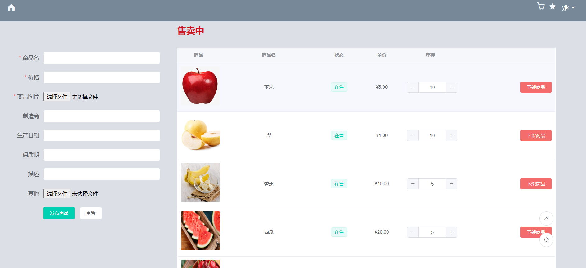

# 系统实现报告

## 实现环境

- VUE 2.5.2

本地构建项目：

```shell
$ cd cyberSeller
$ npm install
$ npm run dev
```

## 系统功能结构图


## 系统功能的运行实例

### 系统功能介绍

我们的商城系统功能介绍如下：

- 首先，进入商城主界面，默认为 `admin` 的游客模式，在主页中，可以浏览所有商品，也可以通过搜索框对商品进行模糊搜索以便筛选，最上方的滚屏将显示目前商城为用户推送的最热门的六种商品。用户可以随时从左上角的主界面按钮返回主界面。
- 随后，用户可以选择`查看详情`查看跳转至商品详情页查看商品的具体信息，也可以选择将商品加入购物车或加入收藏列表。
- 接下来，用户需要登录账号以解锁更多功能。当用户从右上角的登录处注册账号并登录或直接登录已有账号后，右上角将依次显示`我的购物车`、`我的收藏`、`菜单栏`，其中菜单栏中又有`我的订单`、`我的信息`、`地址管理` 及 `发布商品` 这四个子项目。
- 点击`地址管理`按钮，进入到地址管理页面，用户可以在该页面设置默认的收货地址、添加新的收货地址、删除已有的收货地址。
- 点击`我的购物车`按钮，进入到购物车页面，用户可以在该页面查看并编辑自己已加入购物车的所有商品、价格与数量，也可以选择其中的部分或全部商品生成订单并跳转到订单提交页面进行结算。
- 在结算订单时，用户将看到该笔订单的详细信息并可以选择收货地址，在确认无误后即可进行最终结算。
- 点击`我的收藏`按钮，进入到收藏列表页面，用户可以在该页面查看自己已添加收藏的所有商品及相关信息。
- 点击`我的订单`按钮，进入到历史订单页面，用户可以在该页面查看该账号的所有成交过的历史订单信息。
- 点击`我的信息`按钮，进入到用户个人信息分析页面，用户可以在该页面查看该账号的历史数据分析图，了解相关消费趋势。
- 点击`发布商品`按钮，进入到商品发布页面，用户可以在该页面查看并编辑自己已经发布在售的所有商品，也可以选择添加新的商品进行售卖。

### 买家实例


### 卖家实例

卖家可以选择进入`发布商品`页面：



在左侧，卖家可以发布新的商品，其必须给出的参数为商品名、商品价格和商品图片，而制造商、生产日期、保质期、商品描述等为可选参数，卖家可根据自己的需求进行选择是否添加。最后，卖家也可以通过`其他`选项卡上传后缀为`.xlsx`、`.xls`的指定格式的Excel文件，后端可以对其进行解析并展示。

在右侧，卖家可以查看自己已经发布过的所有商品，所有商品信息都将以图片、商品名、售卖状态、单价、库存的形式展示，卖家可以根据自己的需要实时修改所有商品的库存数量或直接下架商品，而平台上的其他用户也将在买家界面同时看到卖家对商品信息的相应修改。

## 程序目录结构简要说明

### 前端

前端项目位于`./cyberSeller`

- `./cyberSeller/src/router/index.js`中为路由文件，负责所有页面的跳转
- `./cyberSeller/src/api.js`中定义了前后端数据交互的中转函数
- `./cyberSeller/src/components/common`中定义了页面的通用组件
- `./cyberSeller/src/components/page`中定义了该项目涉及的所有`.vue`页面
- `./cyberSeller/package.json`与`./cyberSeller/package-lock.json`中含有该项目的环境依赖信息

## 实验感想

@占瑞乙：从系统设计的角度来看，前后端分离可以让前端开发者专注于页面的布局与设计，让后端开发者集中精力处理数据关系而不用关心用户的具体行为。但是这也为实验开发增加了额外的工作量——开发可跨域调用的接口对数据进行转换与传递。在实际设计接口的过程中，我们又要综合考量前后端处理同一问题的便捷程度，权衡前后端的责任边界。此外，在前端显示页面中，经常会涉及到页面数据的初始化和数据刷新引起的页面刷新问题，这就意味着我们需要用尽可能避免从后端获取冗余数据，尽可能在前端实现局部渲染以及引入脏位机制，以增加系统的性能表现。