# 系统实现报告

## 实现环境

- VUE 2.5.2

本地构建项目：

```shell
$ cd cyberSeller
$ npm install
$ npm run dev
```

## 系统功能结构图


## 系统功能的运行实例

### 系统功能介绍

我们的商城系统功能介绍如下：

- 首先，进入商城主界面，默认为 `admin` 的游客模式，在主页中，可以浏览所有商品，也可以通过搜索框对商品进行模糊搜索以便筛选，最上方的滚屏将显示目前商城为用户推送的最热门的六种商品。用户可以随时从左上角的主界面按钮返回主界面。
- 随后，用户可以选择`查看详情`查看跳转至商品详情页查看商品的具体信息，也可以选择将商品加入购物车或加入收藏列表。
- 接下来，用户需要登录账号以解锁更多功能。当用户从右上角的登录处注册账号并登录或直接登录已有账号后，右上角将依次显示`我的购物车`、`我的收藏`、`菜单栏`，其中菜单栏中又有`我的订单`、`我的信息`、`地址管理` 及 `发布商品` 这四个子项目。
- 点击`地址管理`按钮，进入到地址管理页面，用户可以在该页面设置默认的收货地址、添加新的收货地址、删除已有的收货地址。
- 点击`我的购物车`按钮，进入到购物车页面，用户可以在该页面查看并编辑自己已加入购物车的所有商品、价格与数量，也可以选择其中的部分或全部商品生成订单并跳转到订单提交页面进行结算。
- 在结算订单时，用户将看到该笔订单的详细信息并可以选择收货地址，在确认无误后即可进行最终结算。
- 点击`我的收藏`按钮，进入到收藏列表页面，用户可以在该页面查看自己已添加收藏的所有商品及相关信息。
- 点击`我的订单`按钮，进入到历史订单页面，用户可以在该页面查看该账号的所有成交过的历史订单信息。
- 点击`我的信息`按钮，进入到用户个人信息分析页面，用户可以在该页面查看该账号的历史数据分析图，了解相关消费趋势。
- 点击`发布商品`按钮，进入到商品发布页面，用户可以在该页面查看并编辑自己已经发布在售的所有商品，也可以选择添加新的商品进行售卖。

### 用户注册与登录

进入`CyberSeller`在线交易平台后，系统默认以`admin`作为游客模式账号进行登录，页面右上角的菜单栏将被隐藏，仅将登录接口暴露给游客：


用户在游客模式下仅能浏览商品列表及商品详情页，并无用于存储个人数据的专属的个人账号。

在选择`登录`后用户将跳转至注册登录页面，用户可以在此处选择注册或登录自己的账号：

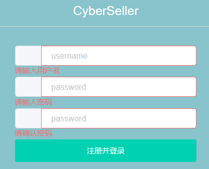

在注册账号时，用户需要确保其输入的用户名合法，以及前后两次输入的密码保持一致，否则，系统将告知`请确保前后密码一致`的错误信息，要求用户进一步检查自己两次输入的密码是否一致。


当然，如果之前已经注册过账号，那么用户可以选择使用已有的账号密码进行登录：

> 这里使用测试账户登录并进行实验和进一步展示
>
> username: zry
>
> password: 123

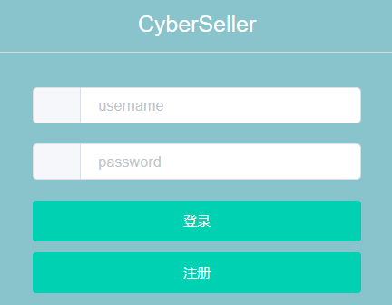


如果输入密码错误或用户名不存在，那么系统会告知`用户名或密码错误`，要求用户进一步检查自己的个人信息后重新提交。


用户在确认密码无误并成功登录后，页面上方将显示`登录成功`的提示窗：


此时页面将自动跳转回主界面进行商品陈列，同时，页面右上角的菜单栏中将为已登录用户解锁更多的功能，即获取了比游客模式更高的访问权限：

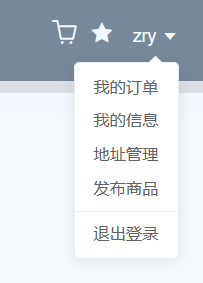

此后，如果用户想要切换账号，或者重新注册账号，可以选择从菜单栏中的`退出登录`按钮，随后将再次跳转至用户的注册与登录界面（退出登录后用户将再次回到游客模式，默认游客名为`admin`）。

### 商品展示及相关操作

在主界面——商品陈列页面中，用户可以在顶部的图片滚播窗口中看到共六项系统基于所有用户数据进行的全平台商品推送，窗口间距为三张图片，滚播窗口共有六张图片：

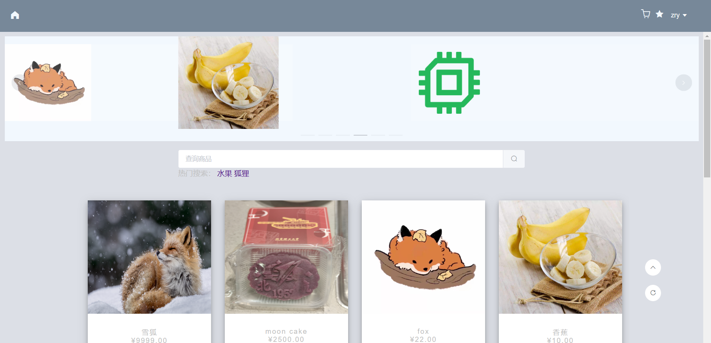

随后，在搜索框中，用户可以通过多种关键词进行商品检索（搜索模式采用完全匹配以及模糊匹配），筛选其所需要的商品，用户可以通过商品名检索相应商品：


用户可以通过价格检索相应商品：


用户可以通过卖家名称检索相应商品：

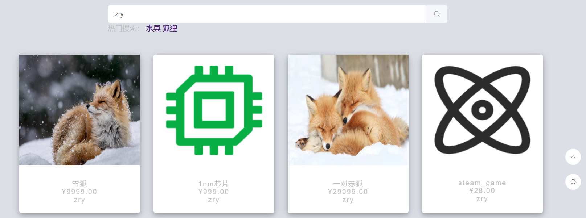

在浏览至商品陈列页面底部后，用户可以选择进行页面跳转，获取其他页面的商品内容：


在浏览过程中，用户可以将指针悬浮在任一商品上，商品卡片栏将会将`查看详情`与`加入收藏夹`按钮暴露给用户，用户可以点击`查看详情`跳转进入商品详情页查看商品的更多相关信息或点击五角星图标将商品加入收藏夹留待以后查看：


在点击`查看详情`后，用户将进入商品详情页，可以查看更多商品相关信息：


用户可以通过点击`加入购物车`或`收藏`按钮将相应数量的该商品加入购物车或加入收藏夹，在成功加入后页面将会返回成功加入购物车/收藏夹的系统提示:


当然，在商品详情页中还会展示当前商品的剩余库存，用户选择加入购物车的商品数量不得超过当前库存总数：


可以看见，当选中的商品数量等于库存数量后，继续添加商品的`+`按钮变灰，成为不可点选状态。

此外，用户可以基于卖家展示的商品图片进行`视觉搜索`，在全网进行商品比对、同类商品信息查询等：

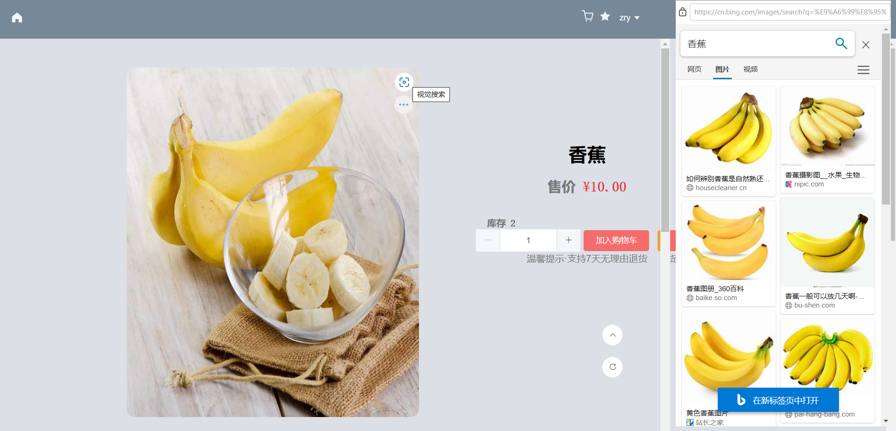

继续下拉页面，用户将看到基于该商品的商品推荐（猜你喜欢）以及卖家展示的商品详细信息：


与商品陈列页面类似，用户可以直接点击`猜你喜欢`一栏中的商品进行跳转，查看感兴趣的其他商品的详细信息：


在浏览完商品信息后，如果用户想要回到主界面继续查询或浏览其他商品，可以通过点击页面左上角的`Home`图标返回主界面。

这里使用一个新注册的账号简单演示本系统的推荐功能。注册并登录后，为新用户`buyer`提供的主界面如下：


在新用户`buyer`购买过一次香蕉之后，系统为用户`buyer`提供的主界面如下：

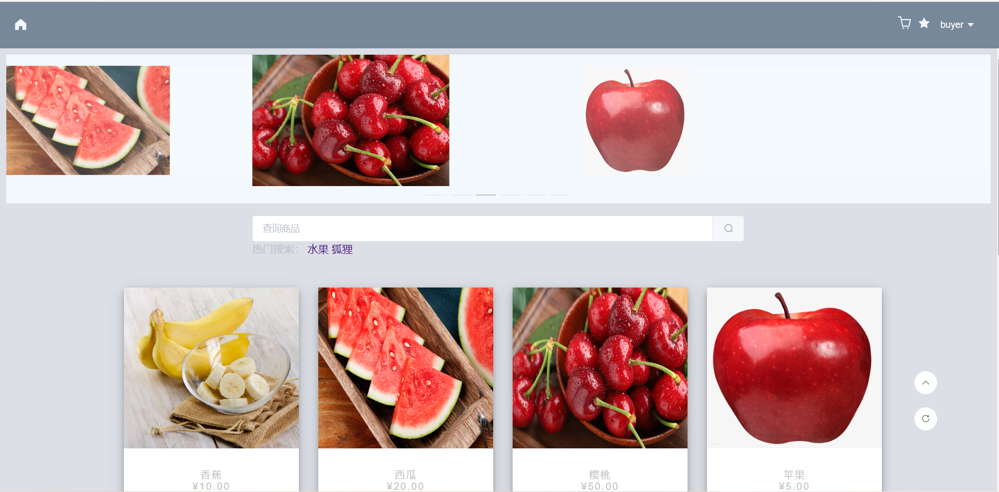

可以看到系统基于用户的历史数据进行了一定程度的相似推荐。

### 买家实例演示

买家可通过选择页面右上角购物车标识图标进入`我的购物车`页面：


在`我的购物车`页面中，买家可以查看所有已加入购物车的商品信息——包含商品图片、商品名、商品状态（售罄或在售）、商品单价、商品数量及总价格。

买家可通过在右上侧的搜索框进行关键词检索，筛选购物车内的特定商品：


选好准备结算的商品后，买家可通过在左侧勾选需要购买的商品，并调整对应商品的数量来进行结算操作：


系统将自动为买家计算所选商品的总件数与总价格，并将其显示在页面右下角。当然，如果商品正处于售罄状态，用户将无法选中该商品进行结算。

点击`结算选中商品`按钮即进入结算界面，买家将可以选择收货地址（默认为默认地址）进行支付结算，在支付前用户可以最后一次确认该笔订单的详细信息（含商品数量及对应价格）：


在买家确认订单信息无误后，可点击`确认支付`按钮进行最终支付，支付成功将获得系统的如下反馈：


此外，买家可通过选择页面右上角五角星标识的图标进入`收藏夹`页面：

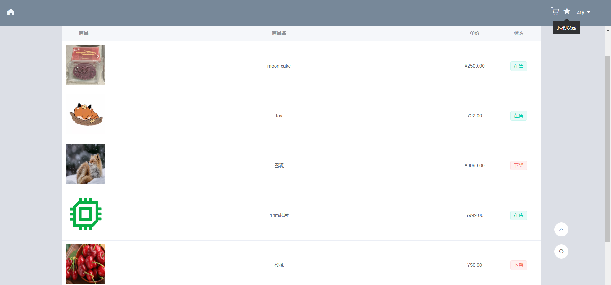

在该页面买家可以进一步查看自己已加入收藏夹的所有商品的商品图片、商品名、价格及商品当前售卖状态等相关信息。

买家可通过选择页面右上角菜单栏中`我的订单`选项卡以进入`我的订单`页面：


在该页面买家可以查询自己每一条已成交历史订单的商品图片、商品名、卖家、价格等相关信息。

买家可通过选择页面右上角菜单栏中`我的信息`选项卡以进入用户的历史数据回顾页面：

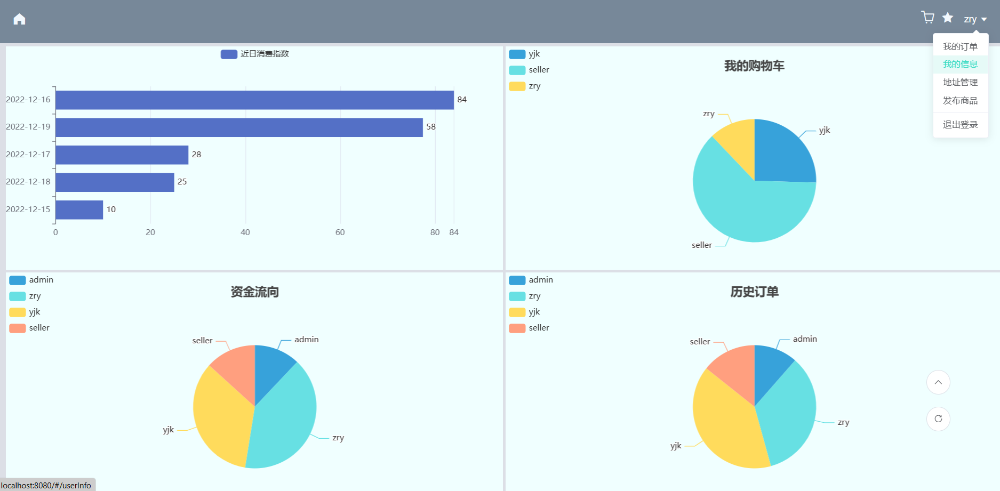

在该页面中共有四个图表，左上角的柱状图会动态对用户的历史消费记录进行动态排序，以日为单位对历史总消费额进行统计；右上角的饼状图会对用户购物车中的商品来源进行统计；左下角的饼状图会对用户的历史支付中的资金流向进行统计；右下角的饼状图会对用户的历史订单按成交次数分布进行统计。由于以上图表均为动态显示模式，所以用户可以根据需求对图表显示数据进行进一步筛选查看或对统计数据及图表进行下载并导出为`.pdf`：


买家可通过选择页面右上角菜单栏中`地址管理`选项卡以进入`地址管理`页面：


买家可以在地址卡片栏顶部选择一个地址将其`设置为默认`、选择`删除地址`删除一个非默认地址、选择`添加`新建一个新的收货地址。

买家可以通过点击`添加`按钮在新建地址界面输入新地址所必需的信息——收件人、联系电话、地址、详细地址，以及可选项——备注。

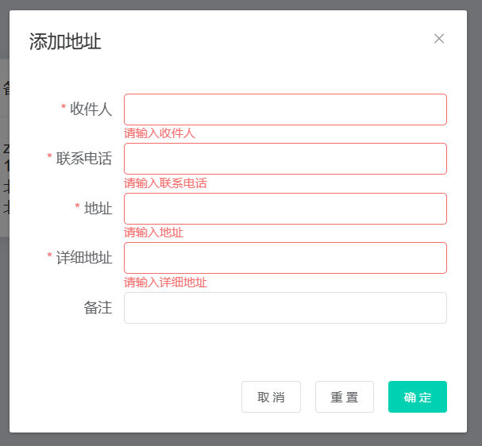

同样，买家可以通过重置按钮一件清空已填写的地址信息，进行重新填写。当买家填写完并确认个人地址信息无误后，可以点击确定按钮确认新建地址：


点击`确定`后新建地址成功，但新建的地址不为默认地址：


再次点击`设置为默认`可以将新建立的备用地址设置为默认地址：

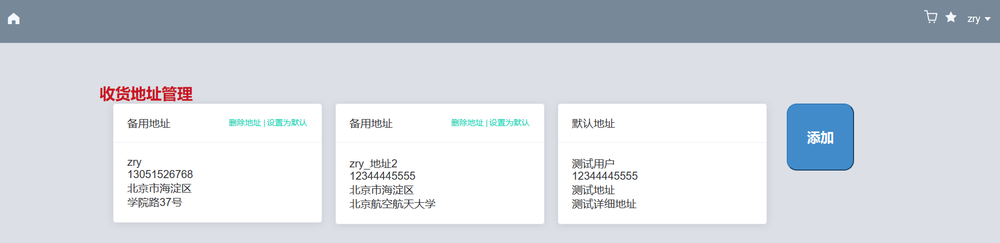

设置默认地址成功，再点击`删除地址`删除第二个备用地址：

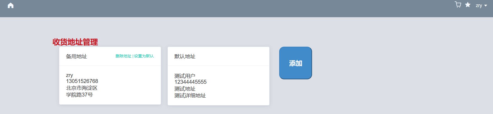

第二个地址被成功删除。

### 卖家实例演示

卖家可通过选择页面右上角菜单栏中`发布商品`选项卡以进入`发布商品`页面：


在左侧，卖家可以发布新的商品，其必须给出的参数为商品名、商品价格和商品图片，而制造商、生产日期、保质期、商品描述等为可选参数，卖家可根据自己的需求进行选择是否添加。最后，卖家也可以通过`其他`选项卡上传后缀为`.xlsx`、`.xls`的指定格式的Excel文件，后端可以对其进行解析并展示：


卖家在上图中填入商品详细信息后，如果发现填入信息有误，可以选择逐项修改，或者选择`重置`按钮进行一键重置，将所有已填入信息进行清空。卖家在确认需要发布的商品信息无误后选择`发布商品`即可立即添加该商品到待售列表：


卖家在右侧已发布商品列表中可以立刻看到自己新添加的商品信息。

在右侧的待售列表中，卖家可以查看自己已经发布过的所有商品，所有商品信息都将以图片、商品名、售卖状态、单价、库存的形式向卖家进行展示，卖家可以根据自己的需要实时修改所有商品的库存数量或直接下架商品，而平台上的其他用户也将在买家界面同时看到卖家对商品信息的相应修改：


卖家可以通过库存数量左右两侧的`-`和`+`按钮对商品库存数量进行逐项修改，特别的，当商品数量为0时，商品的状态将切换为`售罄`状态，而当商品数量大于0时，商品的状态为`在售`状态。

最后，如果卖家决定不再出售某项商品后，可以选择对应商品右侧的`下架商品`按钮：


例如，此处将刚刚发布的商品进行下架后，该商品便在在商品陈列页与卖家的待售商品列表中立刻消失了，在其他用户的商品列表中也将展示为`下架`状态。

## 程序目录结构简要说明

### 前端

前端项目位于`./cyberSeller`，对其中一部分关键目录及文件进行如下说明：

- `./cyberSeller/src/router/index.js`中为路由文件，负责所有页面的跳转
- `./cyberSeller/src/api.js`中定义了前后端数据交互的中转函数
- `./cyberSeller/src/components/common`中定义了页面的通用组件
- `./cyberSeller/src/components/page`中定义了该项目涉及的所有`.vue`页面
- `./cyberSeller/package.json`与`./cyberSeller/package-lock.json`中含有该项目的环境依赖信息

## 实验感想

@占瑞乙：从系统设计的角度来看，前后端分离可以让前端开发者专注于页面的布局与设计，让后端开发者集中精力处理数据关系而不用关心用户的具体行为。但是这也为实验开发增加了额外的工作量——开发可跨域调用的接口对数据进行转换与传递。在实际设计接口的过程中，我们又要综合考量前后端处理同一问题的便捷程度，权衡前后端的责任边界。此外，在前端显示页面中，经常会涉及到页面数据的初始化和数据刷新引起的页面刷新问题，这就意味着我们需要用尽可能避免从后端获取冗余数据，尽可能在前端实现局部渲染以及引入脏位机制，以增加系统的性能表现。