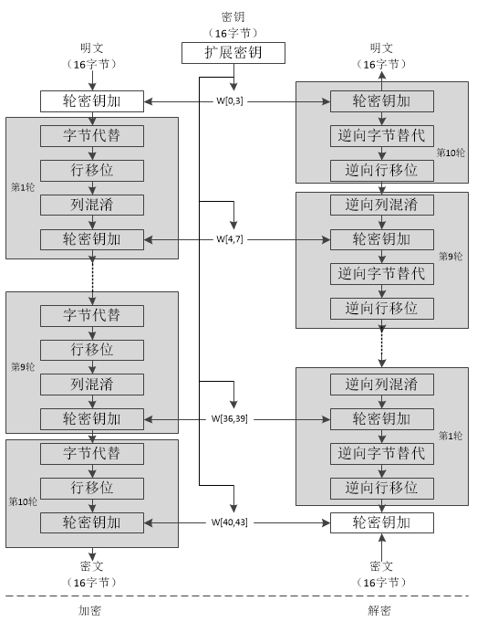

## 系统实现报告

##### `yjk`

### Part 1 实现环境

| 环境   | 版本  |
| ------ | ----- |
| Ubuntu | 20.04 |
| Python | 3.9.7 |
| Django | 3.2   |
| MySQL  | 8.0   |

### Part 2 系统功能结构图

/* TODO */

### Part 3 基本表的定义，主外码等完整性约束定义，索引的定义

#### Account用户表

| 属性名   | 中文名 | 数据类型 | 备注 |
| -------- | ------ | -------- | ---- |
| id       | 编号   | INT      | 主码 |
| name     | 用户名 | VARCHAR  |      |
| password | 密码   | VARCHAR  |      |
| identity | 身份   | VARCHAR  |      |
| balance  | 余额   | DECIMAL  |      |

#### Good商品表

| 属性名      | 中文名   | 数据类型 | 备注        |
| ----------- | -------- | -------- | ----------- |
| id          | 编号     | INT      | 主码        |
| name        | 商品名   | VARCHAR  |             |
| price       | 价格     | DECIMAL  |             |
| seller_id   | 卖家编号 | VARCHAR  | 外键        |
| maker       | 制造商   | VARCHAR  |             |
| picture     | 图片地址 | VARCHAR  | 存储图片URL |
| description | 详细描述 | VARCHAR  |             |
| date        | 生产日期 | VARCHAR  |             |
| shelf_life  | 保质期   | VARCHAR  |             |

#### ShopCart购物车表

| 属性名  | 中文名           | 数据类型 | 备注 |
| ------- | ---------------- | -------- | ---- |
| id      | 编号             | INT      | 主码 |
| user_id | 用户编号         | INT      | 外键 |
| good_id | 商品编号         | INT      | 外键 |
| num     | 购物车内商品数量 | INT      |      |

#### Star收藏表

| 属性名  | 中文名   | 数据类型 | 备注 |
| ------- | -------- | -------- | ---- |
| id      | 编号     | INT      | 主码 |
| user_id | 用户编号 | INT      | 外键 |
| good_id | 商品编号 | INT      | 外键 |
| like    | 是否收藏 | INT      |      |

#### Repo库存表

| 属性名  | 中文名   | 数据类型 | 备注 |
| ------- | -------- | -------- | ---- |
| id      | 编号     | INT      | 主码 |
| user_id | 用户编号 | INT      | 外键 |
| good_id | 商品编号 | INT      | 外键 |
| like    | 是否收藏 | INT      |      |

#### Address地址表

| 属性名        | 中文名         | 数据类型 | 备注 |
| ------------- | -------------- | -------- | ---- |
| id            | 编号           | INT      | 主码 |
| user_id       | 用户编号       | INT      | 外键 |
| receiver_name | 收件人姓名     | VARCHAR  |      |
| phone         | 收件人电话     | VARCHAR  |      |
| addr          | 地址           | VARCHAR  |      |
| detailed_addr | 详细地址       | VARCHAR  |      |
| comment       | 备注           | VARCHAR  |      |
| default       | 是否为默认地址 | VARCHAR  |      |

#### Sale订单表

| 属性名     | 中文名   | 数据类型 | 备注 |
| ---------- | -------- | -------- | ---- |
| id         | 编号     | INT      | 主码 |
| user_id    | 用户编号 | INT      | 外键 |
| address_id | 地址编号 | INT      | 外键 |
| price      | 价格     | INT      |      |
| date       | 日期     | DATETIME |      |

#### SaleGood订单商品表

| 属性名  | 中文名   | 数据类型 | 备注 |
| ------- | -------- | -------- | ---- |
| id      | 编号     | INT      | 主码 |
| sale_id | 订单编号 | INT      | 外键 |
| good_id | 商品ID   | INT      | 外键 |
| num     | 商品数量 | INT      |      |

#### GoodDetail商品详情表

| 属性名     | 中文名   | 数据类型 | 备注 |
| ---------- | -------- | -------- | ---- |
| id         | 编号     | INT      | 主码 |
| user_id    | 用户编号 | INT      | 外键 |
| address_id | 地址编号 | INT      | 外键 |
| price      | 价格     | INT      |      |
| date       | 日期     | DATETIME |      |

#### 索引

对查询常用的属性添加索引可以大大提高查询效率，码的查询频次高，外键多用于关系的连接操作，所以关系的索引设置在主码和外键上，以下加粗部分表示索引：

- 账户表（**编号**，**用户名**，**密码**，身份，余额）

- 商品表（**编号**，商品名，价格，**卖家编号**，制造商，图片地址，描述，生产日期，保质期）
- 购物车表（**编号**，**用户编号**，**商品编号**，数量）
- 收藏表（**编号**，**用户编号**，**商品编号**，收藏）
- 库存表（**编号**，**商品编号**，库存）
- 地址表（**编号**，**用户编号**，收件人姓名，收件人电话，地址，详细地址，备注，默认地址）
- 订单表（**编号**，**用户编号**，**地址编号**，价格，日期）
- 订单商品表（**编号**，**订单编号**，**商品编号**，数量）
- 商品详情表（**编号**，**商品编号**，键值，值）

### Part 4 系统的安全性设计，不同人员的外模式及相关权限

本系统后端采用Django+MySQL的方式来搭建，具有一定的安全性。

<table>
<tr>
	<td></td>
    <td></td>
<tr>
</table>

#### 数据库与控制程序隔离

Django框架将控制程序与数据库解耦，因此控制程序并不会直接产生并调用 SQL 语句来操作数据库，而是通过 OR Mapping 来间接操作数据库。因此安全性有一定的保障——可以防御诸如 SQL 注入的攻击

#### 防御 SQL 注入

SQL 注入能让恶意用户能在数据库中执行任意 SQL 代码。这将导致记录被删除或泄露。

Django 的 querysets 在被参数化查询构建出来时就被保护而免于 SQL 注入。查询的 SQL 代码与查询的参数是分开定义的。参数可能来自用户从而不安全，因此它们由底层数据库引擎进行转义。

#### 防御跨站脚本攻击（XSS）

XSS 攻击允许用户将客户端脚本注入到其他用户的浏览器中。这通常是通过将恶意脚本存储在数据库中，在那里它将被检索并显示给其他用户，或者通过让用户点击一个链接，使攻击者的 JavaScript 被用户的浏览器执行来实现。然而，XSS 攻击可以来自任何不受信任的数据源，如 cookie 或网络服务，只要数据在被纳入页面之前没有被充分净化。Django可以保护免受大多数XSS攻击。

#### 防御跨站点请求伪造（CSRF）

发起 CSRF 攻击的人可以使用其他用户的证书执行操作，且是在其不知情或不同意的情况下。Django 内置了保护措施来防御大多数 CSRF 攻击。

#### Host 头部验证

在某些情况下，Django 使用客户端提供的 `Host` 头部来构造 URLs。这些值虽被清理以阻止跨站脚本攻击，但伪造 `Host` 值还是可以用于跨站请求伪造，缓存毒化攻击，以及电子邮件中的有毒链接。

#### 按用户类别设置外模式与权限

本系统中有两种用户，`admin`和`customer`，其中`admin`作为超级账号对数据库有完全权限，并可以增删改查所有数据，对所有数据进行综合分析等；`customer`作为普通用户账号可以增删改查自己账户内数据，对自己数据进行统计分析等。

#### 数据加密
为了保证数据的安全性，我们对密码，密保问题答案等隐私数据进行加密。项目使用了对称加密方法 AES 进行数据加密。 AES Advanced Encryption Standart ，高级加密标准）是最为常见的对称加密算法。本项目中加密与解密均由服务端完成，所以采用对称的加密算法是既简单又高效的。 AES 是分组加密技术，具体的流程如下图所示：

### Part 5 存储过程、触发器和函数的代码说明

### Part 6 实现过程中主要技术和主要模块的论述

### Part 7 若干展示系统功能的运行实例

### Part 8 源程序简要说明

### Part 9 收获和体会