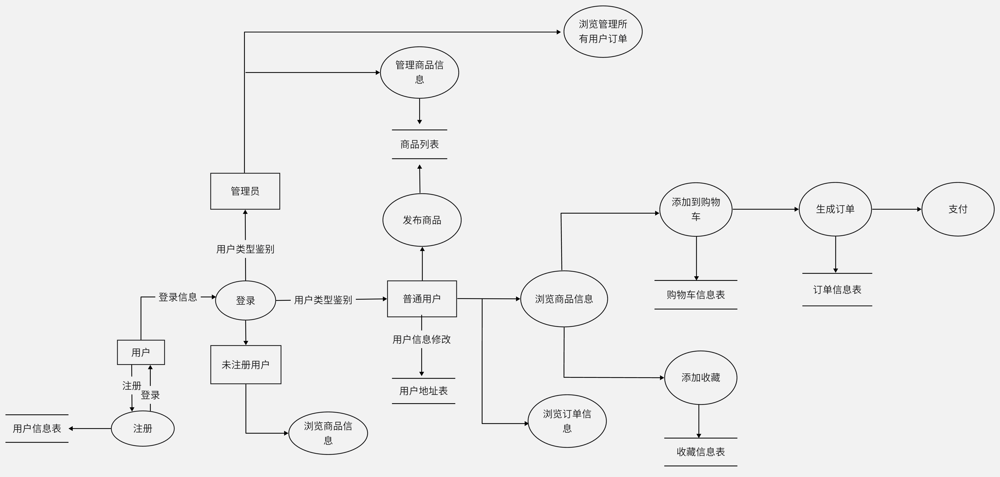

<h1>
    
《数据库系统原理》课程设计

</h1>

<h1>
    
系统设计报告

</h1>

<h2>
    
CyberSeller——全自主线上交易平台

</h2>

<h4>
    
小组成员

</h4>

<h5>
    
于敬凯 20373673

</h5>

<h5>
    
占瑞乙 20373738

</h5>

<h5>
    
金圣浩 20373795

</h5>

<h6>
    
2022年12月

</h6>

[TOC]

<h2>
    
组内同学承担任务说明

</h2>

|                | 于敬凯                                                       | 占瑞乙                                                       | 金圣浩                                                       |
| -------------- | ------------------------------------------------------------ | ------------------------------------------------------------ | ------------------------------------------------------------ |
| 系统设计阶段   | 选题讨论 需求分析 概念设计 关系设计 API设计  | 选题讨论 需求分析 概念设计 关系设计 API设计  | 选题讨论 需求分析 概念设计 关系设计 API设计  |
| 系统实现阶段   | 环境搭建 后端API实现 数据库实现 服务器架设   | 环境搭建 前端布局设计与实现 前后端沟通设计与实现 网络应用接口实现 | 环境搭建 前端布局设计与实现 前后端沟通设计与实现 网络应用接口实现 |
| 总结与材料整理 | 系统设计报告 系统实现报告 答辩PPT                | 系统设计报告 系统实现报告 答辩PPT                | 系统设计报告 系统实现报告 答辩PPT                |
| 贡献百分比     | 33%                                                          | 33%                                                          | 33%                                                          |

## 一、需求分析

### 1. 需求描述

​		本次课程设计的CyberSeller平台集购买商品、发布售卖商品功能于一体，支持为用户个人动态显示用户的消费记录，并支持统计消费数据分析用户的购物行为，推测用户购物爱好倾向，为用户个性化推荐商城中的产品

### 2.功能设计

#### （1）注册

​		输入用户名、密码。如果用户名未被注册且用户名、密码符合格式规范，则注册成功。反之报相应的错误。

#### （2）登录 

​		输入用户名与密码，若用户名与密码正确，则成功登入。若不使用注册用户名，也可登入系统页面并将显示商城中的所有商品列表，但缺少购物、发布商品、浏览购物车等功能。

#### （3）用户相关功能

​		1.普通用户需要拥有发布商品的权限，补充货品后，可以修改发布商品的库存容量，也可以下架发布的商品。

​		2.普通用户需要拥有查看商品名称、商品价格、商品图片等部分可以对非卖家公开的商品信息的权限。

​		3.普通用户需要拥有购买商品的权限，使其可以任意选择购买的商品、购买的数量，并提交生成订单。
​		4.普通用户需要拥有将商品添加至购物车、收藏商品的权限，并可以查看购物车中商品的信息列表、收藏商品的信息列表。

​		5.普通用户需要拥有添加、修改个人信息中收货地址的权限。

​		6.普通用户需要拥有查看个人消费记录（商品数量、消费金额、购买商品商家等记录）等权限。

​		7.普通用户需要具有商品搜索权限，以便根据自己喜欢的关键词进行全局或局部搜索。

​		8.普通用户需要收发个人消息，如接收到“购买成功”、“添加购物车成功”、“添加收藏成功”等消息。

#### （4）管理员相关功能

​	1.管理员需要具有管理商品的权限，可以修改商品属性、下架商品等。

​	2. 管理员需要具有查看、管理所有用户消费数据的权限。

​	

### 3.数据流图

### 3.数据元素表（数据字典）

​	根据前文的需求分析，在数据流中提取原子数据项，得到 9个数据组，其元素表如下：

#### 1. Account用户表

| 属性名   | 中文名 | 数据类型 | 备注 |
| -------- | ------ | -------- | :--: |
| id       | 编号   | INT      | 主码 |
| name     | 用户名 | VARCHAR  |      |
| password | 密码   | VARCHAR  |      |
| identity | 身份   | VARCHAR  |      |
| balance  | 余额   | DECIMAL  |      |

#### 2.Good商品表

| 属性名      | 中文名   | 数据类型 | 备注        |
| ----------- | -------- | -------- | ----------- |
| id          | 编号     | INT      | 主码        |
| name        | 商品名   | VARCHAR  |             |
| price       | 价格     | DECIMAL  |             |
| seller_id   | 卖家编号 | INT      | 外键        |
| maker       | 制造商   | VARCHAR  |             |
| picture     | 图片地址 | VARCHAR  | 存储图片URL |
| description | 详细描述 | VARCHAR  |             |
| date        | 生产日期 | VARCHAR  |             |
| shelf_life  | 保质期   | VARCHAR  |             |

#### 3.ShopCart购物车表

| 属性名  | 中文名           | 数据类型 | 备注 |
| ------- | ---------------- | -------- | ---- |
| id      | 编号             | INT      | 主码 |
| user_id | 用户编号         | INT      | 外键 |
| good_id | 商品编号         | INT      | 外键 |
| num     | 购物车内商品数量 | INT      |      |

#### 4.Star收藏表

| 属性名  | 中文名   | 数据类型 | 备注 |
| ------- | -------- | -------- | ---- |
| id      | 编号     | INT      | 主码 |
| user_id | 用户编号 | INT      | 外键 |
| good_id | 商品编号 | INT      | 外键 |
| like    | 是否收藏 | INT      |      |

#### 5.Repo库存表

| 属性名  | 中文名   | 数据类型 | 备注 |
| ------- | -------- | -------- | ---- |
| id      | 编号     | INT      | 主码 |
| user_id | 用户编号 | INT      | 外键 |
| good_id | 商品编号 | INT      | 外键 |
| repo    | 库存     | INT      |      |

#### 6.Address地址表

| 属性名        | 中文名         | 数据类型 | 备注 |
| ------------- | -------------- | -------- | ---- |
| id            | 编号           | INT      | 主码 |
| user_id       | 用户编号       | INT      | 外键 |
| receiver_name | 收件人姓名     | VARCHAR  |      |
| phone         | 收件人电话     | VARCHAR  |      |
| addr          | 地址           | VARCHAR  |      |
| detailed_addr | 详细地址       | VARCHAR  |      |
| comment       | 备注           | VARCHAR  |      |
| default       | 是否为默认地址 | INT      |      |

#### 7.Sale订单表

| 属性名     | 中文名   | 数据类型 | 备注 |
| ---------- | -------- | -------- | ---- |
| id         | 编号     | INT      | 主码 |
| user_id    | 用户编号 | INT      | 外键 |
| address_id | 地址编号 | INT      | 外键 |
| price      | 价格     | INT      |      |
| date       | 日期     | DATETIME |      |

#### 8.SaleGood订单商品表

| 属性名  | 中文名   | 数据类型 | 备注 |
| ------- | -------- | -------- | ---- |
| id      | 编号     | INT      | 主码 |
| sale_id | 订单编号 | INT      | 外键 |
| good_id | 商品ID   | INT      | 外键 |
| num     | 商品数量 | INT      |      |

#### 9.GoodDetail商品详情表

| 属性名     | 中文名   | 数据类型 | 备注 |
| ---------- | -------- | -------- | ---- |
| id         | 编号     | INT      | 主码 |
| user_id    | 用户编号 | INT      | 外键 |
| address_id | 地址编号 | INT      | 外键 |
| price      | 价格     | INT      |      |
| date       | 日期     | DATETIME |      |

## 二、数据库系统ER图

​	

## 三、数据库系统的逻辑模式

### 1.数据库关系模式

​	注：由 E-R 图得到的关系模式,关系模式的形式化表示为 R(U, D, DOM, F)。U 为组成该关系的属性名，D为 U 中属性所来自的域，DOM 指的是属性与域的映射，F 指的是属性间的依赖关系集合。以下约定 N 表示正整数，FLOAT 表示浮点数，L 为任意字符组成的字符串，T 表示时间，B 表示布尔值。码以下划线标识。

#### (1).实体

​	①  **用户** <{user_Id, user_name, password, identity, balence}, D, DOM, F>

​		其中，D  = {N, L, FLOAT},  DOM={DOM（user_Id）=N,  DOM（password）=DOM（identity）=DOM(use_name) = L， DOM(balance) = FLOAT}，F = {user_Id→user_ame, user_Id→password,user_Id→identity, user_Id→balance}。

​		**主码**：（user_id）

​	

​	② **商品** <{good_id,  good_name, price, maker, picture, description，date, shelf_life, repo}, D, DOM, F>

​	其中D = {L, N, FLOAT}, DOM = {DOM(good_id) = DOM(repo) = N,  DOM(price)= FLOAT， DOM(good_name) = DOM(marker) = DOM(picture) = DOM(description)= DOM(date) = DOM(shelf_life) = L}, F = {good_id→good_name, good_id→price, good_id→marker, good_id→picture, good_id→decription, good_id→date, good_id→shelf_life }。

​		**主码**：（good_id）

​	③ **地址** <{address_id, receiver_name, phone, addr, detailed_addr, comment, default}, D, DOM, F>

​	其中D = {L, N}, DOM = {DOM(address_id)  = DOM(default) = N, DOM(receiver_name) = DOM(phone) = DOM(addr) = DOM(detailed_addr) = DOM(comment ) = L}, F = { address_id→recerive_name, address_id→phone， address_id→addr，address_id→ detailed_addr, address_id→comment, address_id→default} 。

​		**主码**：（address_id）

​	④ **订单** <{order_id，address_id, price_sum, order_date}, D, DOM, F>

​	其中D = {L, N, T, FLOAT}, DOM = {DOM(address_id) = DOM(order_id) = N, DOM(price_sum) = FLOAT, DOM{order_date} = T}, F = {order_id→address_id, order_id→price_sum,  order_id→order_date} 。

​		**主码**：（order_id）

#### (2).联系

​		① 用户售卖商品 AddsaleGood<{user_id，good_id}，D，DOM，F> ，F={good_id→user_id}。

​			**主码**：（good_id)

​		② 添加至购物车 addToCarts<{user_id，good_id， good_incarts_num}，D，DOM，F> ，F={user_id, good_id→good_incarts_num}。

​			**主码**：（good_id、user_id)

​		③ 收藏关系 addCollection <{user_id，good_id}， D，DOM，F>, F = {}

​			**主码**：（good_id、user_id)

​		④  添加订单关系 addOrder<{user_id，order_id}， D，DOM，F>, F = {order_id->user_id}

​			**主码**：（order__id)

​		⑤ 订单商品建立联系 comunicateOrderAndGoods<{good_id，order_id, good_sales_num}， D，DOM，F>,  F = {good_id, order_id -> good_sales_num}

​			**主码**：（good_id, order_id)

### 2.关系模式范式等级的判定与规范化

#### (1) 用户实体

​		**用户**实体 <{<u>user_id,</u> user_name, password, identity, balence}, D, DOM, F>

​		主码：user_id

​		函数依赖：user_Id→user_ame, user_Id→password,user_Id→identity, user_Id→balance

​		每个非主属性对码既没有传递函数依赖，也没有部分函数依赖，故符合 3NF。同时，主属性仅一个，且函数依赖的左部没有非主属性，故不存在主属性对码的部分和传递函数依赖，符合 BCNF。

#### (2) 商品实体

​		**商品**实体 <{<u>good_id</u>,  good_name, price, maker, picture, description，date, shelf_life, repo}, D, DOM, F>

​		主码：good_id

​		函数依赖：good_id→good_name,  good_id→price,   good_id→marker,   good_id→picture, good_id→decription,   good_id→date,   good_id→shelf_life 

​		每个非主属性对码既没有传递函数依赖，也没有部分函数依赖，故符合 3NF。同时，主属性仅一个，且函数依赖的左部没有非主属性，故不存在主属性对码的部分和传递函数依赖，符合 BCNF。

#### (3) 地址实体

​		**地址**实体 <{address_id, receiver_name, phone, addr, detailed_addr, comment, default}, D, DOM, F>

​		主码：address_id 

​		函数依赖：address_id→recerive_name,  address_id→phone，address_id→addr，address_id→ detailed_addr,  address_id→comment, address_id→default

​		每个非主属性对码既没有传递函数依赖，也没有部分函数依赖，故符合 3NF。同时，主属性仅一个，且函数依赖的左部没有非主属性，故不存在主属性对码的部分和传递函数依赖，符合 BCNF。

#### (4) 订单实体

​		**订单**实体 <{order_id，address_id, price_sum, order_date}, D, DOM, F>

​		主码：order_id

​		函数依赖：order_id→address_id,  order_id→price_sum,  order_id→order_date

​		每个非主属性对码既没有传递函数依赖，也没有部分函数依赖，故符合 3NF。同时，主属性仅一个，且函数依赖的左部没有非主属性，故不存在主属性对码的部分和传递函数依赖，符合 BCNF。

​	

#### (5) addSaleGood关系

​		**addSaleGood**关系<{user_id，good_id}，D，DOM，F>

​		主码：good_id

​		函数依赖：good_id→user_id

​		关系中，除主码good_id外，只有一个非主属性user_id, 非主属性对码既没有传递函数依赖，也没有部分函数依赖，故符合 3NF。同时，主属性仅一个，且函数依赖的左部没有非主属性，故不存在主属性对码的部分和传递函数依赖，符合 BCNF。

#### (6)addToCarts关系

​	**addToCarts**关系<{user_id，good_id， good_incarts_num}，D，DOM，F> 	

​	主码：good_id、user_id

​	函数依赖：user_id, good_id→good_incarts_num

​	关系中，除主码(good_id, user_id)以外，也只有一个非主属性good_incarts_num,  非主属性对码既没有传递函数依赖，也没有部分函数依赖，故符合 3NF。同时，函数依赖的左部没有非主属性，符合 BCNF。	

#### (7)addCollection关系

​		**addCollection**关系 <{user_id，good_id}， D，DOM，F>, F = {}

​		主码：（good_id、user_id)

​		函数依赖：{}

​		关系中，除主码(good_id, user_id)以外，没有非主属性，符合3NF。

​		

#### (8)addOrder关系

​		**addOrder**关系<{user_id，order_id}， D，DOM，F>, F = {order_id->user_id}

​		主码：（order__id)

​		函数依赖：order_id -> user_id

​		关系中，除主码order_id外，只有一个非主属性user_id, 非主属性对码既没有传递函数依赖，也没有部分函数依赖，故符合 3NF。同时，主属性仅一个，且函数依赖的左部没有非主属性，故不存在主属性对码的部分和传递函数依赖，符合 BCNF。

#### (9)comunicateOrderAndGoods关系

​		**comunicateOrderAndGoods**关系<{good_id，order_id, good_sales_num}， D，DOM，F>

​		主码：（good_id, order_id)

​		函数依赖： good_id, order_id -> good_sales_num

​		关系中，除主码(good_id, order_id)以外，也只有一个非主属性good_sales_num,  非主属性对码既没有传递函数依赖，也没有部分函数依赖，故符合 3NF。同时，函数依赖的左部没有非主属性，符合 BCNF。

## 四、数据库优化设计

​	为了提高查询效率，我们对数据库做了一些优化。

​	对查询常用的属性添加索引可以大大提高查询效率，码的查询频次高，外键多用于关系的连接操作，所以关系的索引设置在主码和外键上，以下加粗部分表示索引：

- 账户表（**编号**，**用户名**，**密码**，身份，余额）

- 商品表（**编号**，商品名，价格，**卖家编号**，制造商，图片地址，描述，生产日期，保质期）
- 购物车表（**编号**，**用户编号**，**商品编号**，数量）
- 收藏表（**编号**，**用户编号**，**商品编号**，收藏）
- 库存表（**编号**，**商品编号**，库存）
- 地址表（**编号**，**用户编号**，收件人姓名，收件人电话，地址，详细地址，备注，默认地址）
- 订单表（**编号**，**用户编号**，**地址编号**，价格，日期）
- 订单商品表（**编号**，**订单编号**，**商品编号**，数量）
- 商品详情表（**编号**，**商品编号**，键值，值）